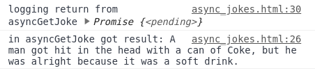

# Async/Await

Async/await provides a bit of syntatic sugar for our promises, and makes our asynchronous code appear to be more synchronous. It can make our code easier to read.

Let's use the dad joke example.

Here is our code from the promises lesson to get a dad joke asynchronously:

```javascript
function getJoke() {
	return new Promise(function(resolve, reject) {
		$.getJSON("https://icanhazdadjoke.com/", dadJoke => {
			if (dadJoke) resolve(dadJoke.joke)
			else reject("Error getting joke")
		})
	})
}
```

We can define an `async` function that calls this function, and waits for the result and logs it:

```javascript
async function asyncGetJoke() {
	let result = await getJoke()
	console.log("in asyncGetJoke got result:", result)
}
```

This looks a lot like synchronous code, but is it? Let's call it and see. Add the above async function to async_jokes.html in the script tag, and this snippet in the `clickCallBack` function used for the button:

```javascript
console.log("logging return from asyncGetJoke", asyncGetJoke())
```

Interesting ...



Even though the code looks synchronous, it is not. It returns a pending promise immediately, and we can see that the log of the promise return happens before the log of the joke itself inside of the function.

Notice that we did not have to use the `.then` method to get the result, we could get it directly using `await`.

Let's look at the implication for our method that compiles jokes, to see how it gives us nicer syntax and easier to understand code that appears to be synchronous:

```javascript
async function asyncCompileJokes(num, callback) {
	let jokes = []
	for (let i = 0; i <= num; i++) {
		jokes.push(await getJoke())
		if (i == 5) callback(jokes)
	}
}
```

Let's compare this to what we had before, using the returned promise directly:

```javascript
function compileJokes(num, callback) {
	let jokes = []
	for (let i = 0; i <= num; i++) {
		getJoke().then(dadJoke => {
			jokes.push(dadJoke)
			if (i == 5) callback(jokes)
		})
	}
}
```

The syntax is nicer, no doubt! But we've made the code slower. Right now, we have to wait for each call to getJoke to resolve before we call it again, unlike our previous implementation, which would call getJoke as many times as we indicated in parallel. Let's prove this to ourselves with some logging:

```javascript
async function asyncCompileJokes(num, callback) {
	let jokes = []
	for (let i = 0; i <= num; i++) {
		console.log("calling getJoke", i)
		jokes.push(await getJoke())
		if (i == 5) callback(jokes)
	}
}
```

We can do it in parallel with `async` and `await`. We can make all the calls to getJoke that we want to make, then await the resolve/reject of all of the promises:

```javascript
async function asyncCompileJokes(num, callback) {
	let promises = []
	for (let i = 0; i <= num; i++) {
		console.log("calling getJoke", i)
		promises.push(getJoke())
		if (i == 5) {
			callback(await Promise.all(promises))
		}
	}
}
```

We used something new here - **Promise.all**. This gives us a way to wait for all promises to settle, and it returns an array with all of the responses. We pass it an array of promises that we want to wait for.

## Error handling

What if a promise results in a rejection? We can use `.catch` on our async function calls just like we can on any function that returns a promise.

```javascript
function clickCallback() {
	asyncCompileJokes(5, logAndDisplayJokes).catch(err => {
		console.log("Got an error from asyncCompileJokes", err)
	})
}
```

With the `.catch` here, if any of our calls to getJoke reject, we'll handle it.
