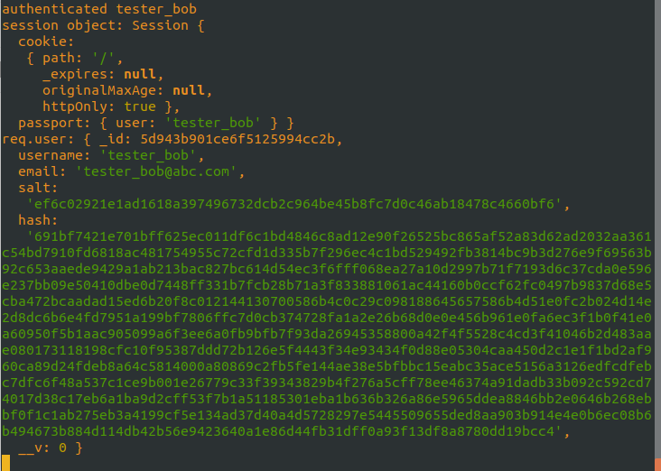
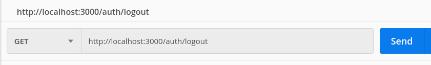
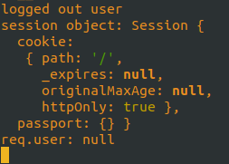

# Authentication

We learned about authentication with Rails, where we used a gem called Devise. In Rails, we could have implemented our own authentication framework, but it makes sense to use one that has been provided by someone else in most cases.

In this lesson, you will learn about how to implement authentication in Nodejs using Passport.js. You will learn about authentication methods or strategies available with passport, and how to use the basic or local strategy. You will learn about how passport integrates with express-session to store the authenticated user information in the session object, and how to use passport-local-mongoose to make things easier.

Using what you learn, you will add a user model to the blog app and implement basic authentication. This includes implmenting authentication routes and the logic required for them, and putting the authentication to use in the app.

Two challenges are provided to extend your learning to implement authorization and user management features.

- [Authentication](#authentication)
  - [References](#references)
  - [Express-session](#express-session)
  - [Creating the User model](#creating-the-user-model)
  - [Passport](#passport)
  - [Authentication Methods](#authentication-methods)
  - [Passport & Strategies](#passport--strategies)
  - [passport-local-mongoose](#passport-local-mongoose)
  - [Adding authentication to our blog application](#adding-authentication-to-our-blog-application)
  - [Installing Passport](#installing-passport)
  - [Adding authentication routes](#adding-authentication-routes)
  - [The register route](#the-register-route)
    - [passport.authenticate](#passportauthenticate)
    - [Testing the register route](#testing-the-register-route)
    - [Check that the user was created in the database](#check-that-the-user-was-created-in-the-database)
  - [The login route](#the-login-route)
  - [Testing the login route](#testing-the-login-route)
  - [The logout route](#the-logout-route)
  - [Testing the logout route](#testing-the-logout-route)
  - [Using our shiny, new authentication](#using-our-shiny-new-authentication)
  - [Adding the username from req.user on CREATE](#adding-the-username-from-requser-on-create)
  - [Testing authentication](#testing-authentication)
  - [Only allow blog post owner to delete and update](#only-allow-blog-post-owner-to-delete-and-update)
  - [Challenge - Adding authorization](#challenge---adding-authorization)
  - [Bonus challenge - user management](#bonus-challenge---user-management)

## References

- [express-session](https://github.com/expressjs/session)
- [Passport](http://www.passportjs.org/)
- [Understanding sessions and local authentication](https://mianlabs.com/2018/05/09/understanding-sessions-and-local-authentication-in-express-with-passport-and-mongodb/)
- [passport-local-mongoose](https://github.com/saintedlama/passport-local-mongoose)
- [express session and passport session](https://www.airpair.com/express/posts/expressjs-and-passportjs-sessions-deep-dive)
- [Passport authentication flow](http://toon.io/understanding-passportjs-authentication-flow/)

## Express-session

Before we get into authentication with Passport, we'll introduce another module we will need: `express-session`. This is used to help manage our server-client sessions and store session data on the server, and handles some of the work for us, such as:

- sending server session cookies as httpOnly and signed by default
- generating unique session ids for each client user session

We can choose to set a `maxAge` for our session cookies, if for example we want to force a user to re-authenticate after some period of time.

Install `express-session`:

```
npm i express-session
```

We can use the session property on any client request to store data that is particular to that client session. For example, we could use it to store how many times they have visited a particular url on our server, or whether or not the user associated with the session is authenticated.

By default, this information is stored in memory on the server. This is typical for development, but not a good practice for production. In production, session data is either stored in one of these ways:

- in a database (i.e., [Mongo](https://www.npmjs.com/package/connect-mongo)),
- in the server file system (i.e., using [filestore](https://www.npmjs.com/package/session-file-store)),
- using a memory-cache system (i.e., [Redis](https://www.npmjs.com/package/connect-redis) or [Memcached](https://www.npmjs.com/package/connect-memcached))

The express-session github has a [list of many compatible store options](https://github.com/expressjs/session#compatible-session-stores)

For now, we'll set up our app to use express-session with in memory storage. Add this to our app.js:

app.js

```javascript
const session = require("express-session")

app.use(
	session({
		// resave and saveUninitialized set to false for deprecation warnings
		secret: "Express is awesome",
		resave: false,
		saveUninitialized: false
	})
)
```

Note that `secret` is the only required option for initialisation of the express-session. As mentioned, it's used to sign our cookies. The other two options shown are required to resolve some deprecation warnings.

We'll get back to using this session after we learn some more about authentication with Passport.

## Creating the User model

We need to decide what we want to store in the user model other than a username and password. For our blog app, it might be useful to also store an email address. At some point, we may want to store other information, and if we do, we would add that to our User schema.

For now, we'll assume having a username, email, and password is sufficent. So what should we add to our User model?

Well as we'll learn, some middleware we'll be using, `passport-local-mongoose`, will add a `username`, a `salt` value used to encrypt and decrypt the password, and the hashed password (as `hash`). Remember that with MongoDB, we don't have to define every field in the schema up front - it is dynamic. We add fields to the schema when we want to use validation, enforce consistency, or enable testing. The only thing we need to add at this point to our schema is the email, and we'll make it required.

models/user.js

```javascript
const mongoose = require("mongoose")
const Schema = mongoose.Schema

const User = new Schema({
	email: {
		type: String,
		required: true
	}
})

module.exports = mongoose.model("User", User)
```

## Passport

With the MERN stack, we will use a third party Express-based middleware called [Passport](http://www.passportjs.org/). Like we've already seen with Node and Express, we will have to do more configuration, even when we use a module like Passport, to set up our application authentication, but it does provide some useful functionality while still allowing the flexibility we need to create authentication that suits any particular application.

## Authentication Methods

There are many different kinds of authentication methods being used today:

- Local or Basic Authentication - username & password
- Tokens like JSON Web Tokens (JWT) - unique token string sent in the header
- OAuth (Open authentication) - Think login via Facebook or Google

For our blog app, we'll use basic authentication for now.

## Passport & Strategies

Passport provides support for many authentication methods through modules called [strategies](http://www.passportjs.org/packages/). Strategies are simply different types of authentication methods. When we use Passport, we will specify which authentication strategies we want to use. We will use the `local` strategy for basic authentication.

## passport-local-mongoose

`passport-local-mongoose` takes care of salting and hashing user passwords, serializing and deserializing the user model (for session storage), and authenticating the username and password credentials with their stored counterparts in the mongo database. If we didn't use this, we would have to implement all of these things manually. Middleware is good.

Additionally, this middleware adds some static methods to our user schema that make life much easier:

- createStrategy() - sets up passport-local LocalStrategy with the correct options
- authenticate() Generates a function that is used in Passport's LocalStrategy (which will take care of validating user credentials)
- serializeUser() Generates a function that is used by Passport to serialize users into the session
- deserializeUser() Generates a function that is used by Passport to deserialize users into the session
- register(user, password, cb) Convenience method to register a new user instance with a given password. Checks if username is unique.
- findByUsername() Convenience method to find a user instance by unique username.

## Adding authentication to our blog application

In this lesson, we'll add authentication to our blog application using Passport. The code from previous lessons is in the **code** directory and we'll start there.


## Installing Passport

To use Passport we first need to install it. From the app project directory, install Passport and add it as a dependency.

```
npm i passport
```

**Passport - Local Strategy**

At the time of this writing Passport has 502 different strategies. The one we will need to provide a basic authentication mechanism is `passport-local`. Passport-local uses a username and password for authentication, which is perfect for us.

Let's install it:

```
npm i passport-local
```

We'll also install `passport-local-mongoose` to make our lives easier:

```
npm i passport-local-mongoose
```

Now that we have the local strategy downloaded lets set it up. According to the passport documentation we need to define some methods on the passport object - pariticularly we need to define the strategy, and tell passport how to serialize and deserialize users so it can add the user information to the session. The problem is where to place these methods. Lets create a new directory called config where we will have a passport.js file to hold all this configuration.

directory

```
app.js
├── config
    └── passport.js
```

Ok lets setup passport.

passport.js

```javascript
const passport = require("passport")
const User = require("../models/user")

passport.use(User.createStrategy())

passport.serializeUser(User.serializeUser())
passport.deserializeUser(User.deserializeUser())
```

Here we are using `passport-local-mongoose` to set up the local strategy and tell `passport` to use it.

We are also taking advantage of the `serializeUser` and `deserializeUser` functions provided by `passport-local-mongoose`, and configuring `passport` to use those.

In order for all of this `passport-local-mongoose` goodness to work, we have to add one more thing to our `model/user.js` file - we have to _plugin_ our `passport-local-mongoose` middleware with our User schema:

user.js

```javascript
// plugin the passport-local-mongoose middleware with our User schema
User.plugin(passportLocalMongoose)
```

Next we need to actually connect passport to our application. To do this, we need to initialize passport, and make it use the express-session. Before we initialize passport, we need to execute the passport configuration we put in `config/passport.js`. This is what we add to app.js to do all of these things:

app.js

```javascript
require("./config/passport")
app.use(passport.initialize())
app.use(passport.session())
```

It's important that these three lines go AFTER we tell our app to use the express-session. You can look at the `app.js` in the code-complete directory if you are unsure of where to put this code.

Ok so in this file we are requiring our passport setup from the `config/passport.js` file then passing passport to our application as a middleware with **passport.initialize()**. We use **passport.session()** when we want passport to keep track of our logged in user. **But don't be confused - passport.session is the same as our express-session**. There are not two session objects - only one. Passport just uses the express-session to store authenticated user information (specifically the username). We'll log the session once we've implemented authentication so you can see this.

So we have passport configured and bound to our application.

## Adding authentication routes

Now we can add some authentication routes to our application. We will need three routes:

- register (POST because we need to send user data)
- login (POST because we need to send user data)
- logout (GET because we use the user data stored in the session for logout and don't send any data)

To prepare, we'll create 2 new files:

```
├── controllers
    └── auth_controller.js
├── routes
    └── auth_routes.js
```

We will put the logic directly in our `auth_controller.js` for the authentication routes.

## The register route

To implement the register route logic in the auth_controller.js, we will use some of the passport-local-mongoose helper functions. We will need to require both passport and our User model:

auth_controller.js

```javascript
const passport = require("passport")
const User = require("../models/user")

const register = function(req, res) {
	User.register(
		new User({
			username: req.body.username,
			email: req.body.email
		}),
		req.body.password,
		function(err) {
			if (err) {
				res.status(500)
				res.json({
					error: err
				})
			} else {
				// Log in the newly registered user
				// passport.authenticate returns a function that we will call with req, res, and a callback function to execute on success
				passport.authenticate("local")(req, res, function() {
					console.log(`authenticated ${req.user.username}`)
					res.status(200)
					res.json(req.user)
				})
			}
		}
	)
}

module.exports = { register }
```

There's a lot going on here, so let's break it down.

As mentioned above in the description of `passport-local-mongoose`, the `register` helper function provided on the User schema takes three parameters - a user object, password, and a callback function that will be executed once the user is registered.

In the code above, we are:

- creating the user for the first parameter using the username and email in req.body by calling User.create
- passing the password from req.body as the second parameter
- defining an anonymous callback function for the third parameter

In the callback function, if we receive an error, we send it back in the response with a `500` status and the error message. Otherwise, we authenticate the user (we could require the user to log in explicitly after the register step instead).

### passport.authenticate

In the call to `passport.authenticate`, we pass the strategy, 'local', and it **returns a function**. We call that authenticate function that is returned with three parameters: req, res, and a callback function. If the user is successfully authenticated, the user object is serialized (with `passport.serializeUser`) and attached to the session as `req.session.passport.user`. It is then read from the session and attached to `req.user`, deserialized. When the callback function is executed, this has all been done, and any remaining middleware has access to the user object in `req.session` and `req.user`. If authentication fails, passport sends back a `401` status (Unauthorized) and does not execute the callback function.

In the callback function, we set status to 200, and send back the deserialized user object from `req.user` as json.

The serialized user information in the session will be available until we call `req.logout`, which will remove the user information from the session, or until the session between the client and server ends. Each time a request comes to our server, passport checks the session object for a serialized user. If it finds one, it deserializes it (using `passport.deserializeUser`), and adds it to `req.user`.

Now to add the route in auth_routes.js. We will have to require `express`, `express.Router`, and the `register` function in `auth_controller`:

auth_routes.js

```javascript
const express = require("express")
const router = express.Router()
const { register } = require("../controllers/auth_controller")

router.post("/register", register)

module.exports = router
```

To complete this, we'll tell our app to use this router for '/auth' routes (and we'll have to add a require statement to app.js to bring in that router):

app.js

```javascript
const authRouter = require("./routes/auth_routes")
app.use("/auth", authRouter)
```

Now we can test it! We will test manually with Postman, because testing with passport is tricky and is a lesson for another time.

First test - does the server run? Try it with `npm start`. If there are any problems, try to figure it out and get help if you need it. The completed code is available in `code-complete` if you get really stuck.

### Testing the register route

From Postman, set up a POST request on `http://localhost:3000/auth/register`. What will you have to put in the body?


If everything is working, we should get the user object back in the response.


Notice that our User object has a username, email, salt, and hash field (the other two fields are added by mongo for it's purposes, including the unique \_id).

### Check that the user was created in the database

From a terminal window, run the mongo shell and verify the `user` collection was created in the `blog_app` database, and that it now has a document for our test user:

```
mongo
> use blog_app
> show collections
posts
users
> db.users.find()
```


## The login route

We've already written code to implement the logic for the login route - it's in `register` already (`passport.authenticate`). We'll pull it out into a helper function to keep our code DRY, and add a log of the session and req.user object so we can see what is added by passport when a user is authenticated:

auth_controller.js

```javascript
const authenticate = passport.authenticate("local")
// helper function
function loginUser(req, res) {
	authenticate(req, res, function() {
		console.log("authenticated", req.user.username)
		console.log("session object:", req.session)
		console.log("req.user:", req.user)
		res.status(200)
		res.json(req.user)
	})
}
```

Now replace the code in the register function with a call to this helper function:

auth_controller.js

```javascript
const register = function(req, res) {
	User.register(
		new User({
			username: req.body.username,
			email: req.body.email
		}),
		req.body.password,
		function(err) {
			if (err) {
				res.status(500)
				res.json({
					error: err
				})
			} else {
				loginUser(req, res)
			}
		}
	)
}
```

And we can use the same helper function to define our login route logic. We can even just do this in the `exports` statement like this:

auth_controller.js

```javascript
module.exports = {
    register,
    login: loginUser,
    logout
};
}
```

Add the POST login route to auth_routes.js:

auth_routes.js

```javascript
const { register, login } = require("../controllers/auth_controller")

router.post("/register", register)
router.post("/login", login)
```

And now we can test it!

## Testing the login route

Again we'll test manually with Postman. We can use the same setup we just used to register the test user, and just change the url to `http://localhost:3000/auth/login`:


If everything goes well, the user object will be sent back.


You should see this in the console in the terminal where the server is running:



This item was added by passport to the session:

```
passport: {user: 'tester_bob'}
```

And the deserialized user object has been added to `req.user`.

## The logout route

The last route to implement is the simplest. Passport provides a helper function on the request object that can be used to remove the user information from the session, which essentially logs out the user: `req.logout()`.

Add this to auth_controller.js:

```javascript
const logout = function(req, res) {
	req.logout()
	console.log("logged out user")
	console.log("session object:", req.session)
	console.log("req.user:", req.user)
	res.sendStatus(200)
}
```

We'll log the session object so we can see how it changes when we log a user out.

Update the exports in auth_controller.js:

```javascript
module.exports = {
	register,
	login,
	logout
}
```

Then add the route to auth_routes.js:

```javascript
const express = require("express")
const router = express.Router()
const { register, login, logout } = require("../controllers/auth_controller")

router.post("/register", register)
router.post("/login", login)
router.get("/logout", logout)

module.exports = router
```

## Testing the logout route

Using Postman, test logout. Since we've made code changes and the server has restarted, we will have to log our test user in again first, then log out.

After we log in, we can see the user is in the session object if we look at the server console log:


In Postman, send a GET request to the logout url:



We should get a 200 status back, and the passport attribute is removed from the session as shown in the server console log:



## Using our shiny, new authentication

Now we can authenticate users! Let's put that feature to work. In our blog app, we should only allow a user to make, change, or delete a post if they are authenticated.


We will add a piece of middleware to our posts_controller.js that will determine if we have an authenticated user in the session. We can use a helper method called `isAuthenticated()`, provided by passport on the request object. If it returns true, we'll call next(), and if not, we'll send a 403 (Forbidden) status:

posts_controller.js

```javascript
const userAuthenticated = function(req, res, next) {
	if (req.isAuthenticated()) {
		return next()
	} else {
		res.sendStatus(403)
	}
}
```

To use this middleware, we need to export it from posts_controller.js:

```javascript
module.exports = {
	getPosts,
	getPost,
	makePost,
	removePost,
	changePost,
	userAuthenticated
}
```

We'll import it to posts_routes.js so we can use it. We could add it to each of the three routes individually like this:

posts_routes.js

```javascript
// CREATE
// POST on '/posts'
// Creates a new post
router.post("/", userAuthenticated, makePost)

// DELETE
// DELETE on '/posts/:id'
// Deletes a post with id
router.delete("/:id", userAuthenticated, removePost)

// UPDATE
// PUT on 'posts/:id'
// Updates a post with id
router.put("/:id", userAuthenticated, changePost)
```

Alternatively, we could just use it once, before the routes where we want it applied:

posts_routes.js

```javascript
const express = require("express")
const router = express.Router()
const {
	getPosts,
	getPost,
	makePost,
	removePost,
	changePost,
	userAuthenticated
} = require("../controllers/posts_controller")

// READ
// GET on '/posts'
// Returns all posts
router.get("/", getPosts)

// READ
// GET on '/posts/:id'
// Returns post with given id
router.get("/:id", getPost)

// For post, delete, put -require authenticated user
router.use(userAuthenticated)
// CREATE
// POST on '/posts'
// Creates a new post
router.post("/", makePost)

// DELETE
// DELETE on '/posts/:id'
// Deletes a post with id
router.delete("/:id", removePost)

// UPDATE
// PUT on 'posts/:id'
// Updates a post with id
router.put("/:id", changePost)

module.exports = router
```

The result of doing this is that the GET routes for `/posts` will not use the middleware, but all of the routes defined after the `use` statement (CREATE, DELETE, and UPDATE routes) will use it.

## Adding the username from req.user on CREATE

Right now, we are assuming the username comes from the client when we create a blog post, but this isn't quite right. We should get the username from the currently logged in user. This is a simple change in `makePost` in `posts_controller.js`:

posts_controller.js

```javascript
const makePost = function(req, res) {
	// add the username from req.user
	req.body.username = req.user.username
	// addPost returns a promise
	addPost(req)
		.then(post => {
			res.status(201)
			res.send(post)
		})
		.catch(err => {
			res.status(500)
			res.json({
				error: err.message
			})
		})
}
```

## Testing authentication

To test this, first verify that our GET routes for `/post` work even if a user is not authenticated. You can logout first, but if you made code changes, the server would have restarted, destroying the session with the logged in user anyway.

After you prove to yourself that the GET routes for `/post` work, try to create a post without logging in first. This should fail in Postman:


Delete and update should produce the same result.

Now login, and try again. This should succeed. Remember to leave the username out of the request body in Postman, and verify it is set by the posts_controller from the session (even if you specify username in the request body in Postman, it should just be overwritten by the posts_controller).


Awesome!

We're nearly done, but there is one more thing to handle. We want any authenticated user to be able to create a blog post, but only the owner of a post should be able to update or delete it, so we need to add some middleware for this.

## Only allow blog post owner to delete and update

We can accomplish this using another piece of middleware in posts_routes.js that we will define in posts_controller.js. The middleware will get the post from the id passed to DELETE, and make sure the `post.username` matches the `req.user.username`. If it doesn't, it will set an error on req, that we will check for in `makePost` and `changePost`:

posts_controller.js

```javascript
const removePost = function (req, res) {
    // Check for error from middleware
    if (req.error) {
        res.status(req.error.status);
        res.send(req.error.message);
    } else {
        // deletePost returns a promise
        deletePost(req.params.id).then(() => res.sendStatus(204))
            .catch((err) => {
                res.status(500);
                res.json({
                    error: err.message
                })
            });
    }
};

const changePost = function (req, res) {
    // Check for error from middleware
    if (req.error) {
        res.status(req.error.status);
        res.send(req.error.message);
    } else {
        // updatePost returns a promise
        updatePost(req).then((post) => {
            res.status(200);
            res.send(post);
        }).catch((err) => {
            res.status(500);
            res.json({
                error: err.message
            })
        });
    }
};

const verifyOwner = function (req, res, next) {
    // If post owner isn't currently logged in user, send forbidden

    if (req.user.role === 'admin') {
        next();
    } else {
        getPostById(req).then((post) => {
                if (req.user.username !== post.username) {
                    req.error = {
                        message: 'You do not have permission to modify this post',
                        status: 403
                    };
                }
                next();
            })
            .catch((err) => {
                req.error = {
                    message: 'Post not found',
                    status: 404
                }
                next();
            });
    }
}

module.exports = {
	getPosts,
	getPost,
	makePost,
	removePost,
	changePost,
	userAuthenticated,
	verifyOwner
}
```

Now use the middleware in posts_routes.js. We will have to use the middleware directly in the route implementations or `params.id` won't be set on the request object (make sure you remember to add this new middleware function to the `require` statement for posts_controller):

posts_routes.js

```javascript
// DELETE
// DELETE on '/posts/:id'
// Deletes a post with id
router.delete("/:id", verifyOwner, removePost)

// UPDATE
// PUT on 'posts/:id'
// Updates a post with id
router.put("/:id", verifyOwner, changePost)
```

That should do it. Test that if you create a post with a logged in user, you can update and delete that post. Also test that if you try to delete or update a post that was created by another user, you cannot update or delete it.

## Challenge - Adding authorization

**Add an admin role - allow admin to delete and update any post**

One common way to implement authorization is using roles.

Our blog application would benefit from an admin user role. The admin user would have permissions to do things like delete offensive content, or to block users.

We can add a role attribute to our User schema, and set it to a default value, like 'basic', or just 'user'. An admin user could have the role 'admin'. As a start, we could add an additional check for the delete and update routes - right now we only allow those actions if the post owner is the currently logged in user. We could change that check to allow the action if the logged in user is either the post owner, or has the admin role. This is your challenge!

1. Add a `role` field to the User schema. Make the default value 'user'. (_Hint: You will have to make a change to the register function in the auth_controller_).
2. Change the `verifyOwner` middleware to allow the next action if the logged in user has the `admin` role (or is the owner of the post).
3. Test your changes! Can an admin user delete or update someone else's post? If the user is not admin, can they delete or update someone else's post?

## Bonus challenge - user management

**Part 1:**
Add another field to the user schema called 'blocked' that is 'false' by default.

If a user is blocked, do not allow them to create, update, or delete any posts.

**Part 2:**
Implement a way for an admin user to delete or block/unblock another user.

There are a number of ways to do this, but if we want to consider further enhancements to the app, it would be best to add a users router and controller (and user_utilities). This is where we would put code to manage users, including deleting, updating, and blocking or unblocking users (which we could do with an update). We already have a way to add users with register.

Try using what you've learned in these past lessons to add this functionality. Make sure that only an authenticated user with an admin role is allowed to delete another user, or to change the blocked property of a user. 

