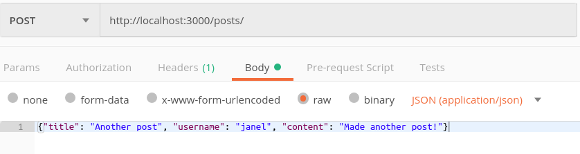

# Blog - creating a CRUD application

- [Blog - creating a CRUD application](#blog---creating-a-crud-application)
	- [References](#references)
	- [The server-side routes for CRUD operations](#the-server-side-routes-for-crud-operations)
		- [CREATE](#create)
		- [READ](#read)
		- [UPDATE](#update)
		- [DELETE](#delete)
	- [Create the app structure](#create-the-app-structure)
		- [npm init, install dependencies](#npm-init-install-dependencies)
		- [Create the directories and files](#create-the-directories-and-files)
	- [Build the router](#build-the-router)
	- [Challenge](#challenge)
		- [Part 1](#part-1)
		- [Part 2](#part-2)

## References
[Testing setup and tear down](https://jestjs.io/docs/en/setup-teardown)
[Query strings and Express.js](https://flaviocopes.com/express-get-query-variables/)

In this lesson, we'll create a blog to learn how to make a CRUD application in JavaScript. First we'll focus on the server-side, implementing it with Express.js.

We'll write some automated tests as we go to make sure our express app is working as expected, so that when we get to implementing the client, we can feel confident the server will always respond as we expect.

As we continue, we'll add support for MongoDB and authentication, we'll learn about how we can use cookies and the session, and then later how to build a front-end for our blog in React.js.

## The server-side routes for CRUD operations


Our blog server app will provide the following operations:

### CREATE

**POST a new blog post**

A route for POST on "/posts" will create a new blog post with the information in req.body. It should return the new post.

### READ

**GET all blog posts**

A route for GET on "/posts" will return an object with all blog posts.

**GET post by id**

A route for GET on "/posts:id" will return a single blog post with the specified id, or null if it isn't found.

**Other read routes**

In a future enhancement, we could provide other functions, such as:

- blogs by username
- blogs by category

### UPDATE

**PUT an update to a post**

A route for PUT on "/posts:id" will update a single post with the information in req.body.

### DELETE

**DELETE a post**

A route for DELETE on "/posts:id" will delete a single post with the specified id.

## Create the app structure

### npm init, install dependencies

**1. Initialise the project with `npm init`.**

**2. Install dependencies:**

- express
- cors
- body-parser

**3. Install development dependencies (with --save-dev):**

- nodemon
- jest

(We'll leave out forever this time)

**4. Add a script to run the server**

If we define a `start` script, we can run it with `npm start`

```javascript
  "scripts": {
    "start": "nodemon app.js"
  }
```

**5. Add a script to test the server**

```javascript
  "scripts": {
    "test": "jest",
  }
```

### Create the directories and files

**routes directory**

Create a file called **posts_routes.js** to store the router creation for the blog posts routes.

**controllers directory**

Create a file called **posts_controller.js** to store the functions used by the blog posts router.

Create a file called **posts_controller.tests.js** to store automated tests for the blog posts controller functions.

**utils directory**

Create a file called **utilities.js** to store utility or helper functions.

Create a file called **utilities.test.js** to store automated tests for the utility functions.

**data directory**

For now we will store data in a .json file. Create a **blog_posts.json** to store the blog posts data. Put one entry in the file to use for manual testing:

blog_posts.json
```javascript
{
  "1": {
    "title": "My first blog post",
		"create_date": "20/09/2019",
		"modified_date": "20/09/2019",
    "username": "janel",
    "content": "This is my first blog post!",
    "category": ""
  }
}
```

Create another file called **blog_posts.test.json**, and just put an empty object in it. We'll use this for automated testing:

blog_posts.test.json
```javascript
{}
```

**app.js**

Will define the application, enable application middleware (cors and body-parser), set up routing (using the router), and make it listen (on port 3000):

app.js
```javascript
const express = require("express")
const cors = require("cors")
const bodyParser = require("body-parser")
const postRouter = require("./routes/posts_routes")

const port = 3000

const app = express()
app.use(cors())
app.use(bodyParser.json())

app.use("/posts", postRouter)

app.listen(port, () => {
	console.log(`Blog express app listening on port ${port}`)
})
```

## Build the router

We know we will need `express()` and `express.Router()`, so we can declare those at the top of our `posts_routes.rb`:

posts_routes.rb
```javascript
const express = require("express")
const router = express.Router()
```

And at the end of the file, we'll export the router:

posts_routes.rb
```javascript
module.exports = router
```

As we discussed, we'll need to define the following routes:

posts_routes.rb
```javascript
// READ
// GET on '/posts'
// Returns all posts

// READ
// GET on '/posts/:id'
// Returns post with given id

// CREATE
// POST on '/posts'
// Creates a new post

// DELETE
// DELETE on '/posts/:id'
// Deletes a post with id

// UPDATE
// PUT on 'posts/:id'
// Updates a post with id
```

Before we start - make sure our skeleton app runs:

```npm start```

### READ routes

Read routes are simplest to implement and test, so we'll start with those. We'll define some functions in `posts_controllers.js` and `utilites.js` to implement the logic of the routes, so from `posts_routes.js`, we can simply define the following:

posts_routes.js

```javascript
const { getPosts, getPost } = require("../controllers/posts_controller")

// READ
// GET on '/posts'
// Returns all posts
router.get("/", getPosts)

// READ
// GET on '/posts/:id'
// Returns post with given id
router.get("/:id", getPost)
```

**utilities.js**

In `utilities.js`, define the core logic for these routes. We will have to read the `blog_posts.json` file in from here. When we get post by id, the id will come from the client as a parameter, like we previously saw in rails.

In addition to the two utility functions to get blog post data, we will use a couple of helper functions to enable testing (`setDataFile`, `loadData`, and `getDataFileRelativeToApp` - for writing data back to the file).

utilities.js
```javascript
let dataFile = "../data/blog_posts.json";
let blogPosts = require(dataFile);

const getAllPosts = function() {
	return blogPosts;
};

const getPostById = function(req) {
	let post = blogPosts[req.params.id];
	if (post) return post;
	else req.error = "Post not found";
};

// Allows flexibility for testing
const setDataFile = function (fileName) {
  dataFile = fileName;
  loadData();
};

// Loads data from dataFile
function loadData() {
  blogPosts = require(dataFile);
}

const getDataFileRelativeToApp = function (file) {
  // Remove the ../ from the dataFile path for writing
  // because the writeFile looks for path relative to the app, not utilities.js
  return file.substring(file.lastIndexOf('../') + 3, file.length);
};

module.exports = {
	getAllPosts,
	getPostById,
	setDataFile,
	getDataFileRelativeToApp
};
```
---

**Passing back errors**

One simple way to pass errors (and other information) back from utility functions and middleware is to add it to the request object. This is what we are doing in `getPostById` to send an error message back to the route handler.

---

### Testing utilities.js

We can write simple tests for the functions in `utilities.test.js`. Unlike with Rails, we have to manually setup and tear down when we test, and that includes setting up our test data.

---

It is important to make sure our data is freshly set up for each test, so we don't create brittle tests. For example, if our tests have to be run in some order to execute as expected, or depend on data set up outside of the test to execute successfully, small changes can break our tests, and lead us astray because they are not related to problems in our code. This leads to ignoring test errors or disabling tests to avoid time spent debugging bad tests.

---

utilities.test.js
```javascript
const utilities = require('./utilities');
const fs = require('fs');
// Use test data file
const testDataFile = '../data/blog_posts.test.json';
// When we write to the file, the path is relative to app.js
const testDataFileForWrite = utilities.getDataFileRelativeToApp();

beforeEach(() => {
  // Set and load data from test data file
  setupData();
});
afterEach(() => {
  // Empty test file data
  tearDownData();
});

describe('getAllPosts with one post', () => {
  it('should get a post if one exists', () => {
    expect(Object.keys(utilities.getAllPosts()).length).toBe(1);
  });
  it('username of first post should be tester', () => {
    expect(utilities.getAllPosts()["1"].username).toBe('tester');
  });
});

describe('getPostById', () => {
  // Define a req object with the expected structure to pass a parameter
  const req = {
    params: {
      id: "1"
    }
  }
  it('username of post with id 1 should be tester', () => {
    expect(utilities.getPostById(req).username).toBe('tester');
  });
});

// Setup and tear down functions
function setupData() {
  let testPostData = {};
	let testPost = {};
	let date = Date.now();
  testPost.title = 'Test post 1';
  testPost.username = 'tester';
	testPost.create_date = date;
	testPost.modified_date = date;
  testPost.content = 'This is the first test post';
  testPost.category = '';
  testPostData["1"] = testPost;

  fs.writeFileSync(testDataFileForWrite, JSON.stringify(testPostData));
  utilities.setDataFile(testDataFile);
}

function tearDownData() {
  let testPostData = {};
  fs.writeFileSync(testDataFileForWrite, JSON.stringify(testPostData));
}
```

We can test this right away with `npm test`. This will prove that our `utilites.js` is reading in our test data, and returning the expected result for these two functions.


**posts_controller.js**

In `posts_controller.js`, define the functions that will be used in `posts_routes.js`. While we define the base logic in `utilities.js`, we use `posts_controller.js` to handle sending the response status and body back to the client:

posts_controller.js
```javascript
const { getAllPosts, getPostById } = require("../utils/utilities");

const getPosts = function(req, res) {
	res.send(getAllPosts());
};

const getPost = function(req, res) {
	let post = getPostById(req);
	if (post) res.send(post);
	else {
		res.status(404);
		res.send(req.error);
	}
};

module.exports = {
	getPosts,
	getPost
};
```

We can define tests for the `posts_controller`, but it requires some mocking of the request and response objects used in the functions. We'll look at this in another lesson, but one reason we create the controller functions is to make it possible to automate testing of our route logic.

**posts_routes.js**

In `posts_routes.js`, require the controller functions, and define the get routes for all blog posts and a blog post by id:

posts_routes.js
```javascript
const { getPosts, getPost } = require("../controllers/posts_controller");

// READ
// GET on '/posts'
// Returns all posts
router.get("/", getPosts);

// READ
// GET on '/posts/:id'
// Returns post with given id
router.get("/:id", getPost);
```

Test the read routes manually with Postman and/or a browser.

### CREATE route
The create function will add a post to the blog. The blog post data will come from the client in the request. The server will validate the data, add the post to the blog in memory, then update the persisted data (stored in a file in this implementation).

The creation of a blog post will come as a POST request on the url `/posts`.


**utilities.js**

First define the core functionality in `utilities.js`. To do this implement one function to export:
- addPost

We also need a couple of helper functions:
- getNextId (will get the next available id)
- writePosts (to persist our data)

utilties.js
```javascript
const addPost = function(req) {
	try {
		let id = getNextId();
		// set create and modified date to now for a new post
		let date = Date.now();
		blogPosts[id] = {};
		blogPosts[id].title = req.body.title;
		blogPosts[id].create_date = date;
		blogPosts[id].modified_date = date;
		blogPosts[id].username = req.body.username;
		blogPosts[id].content = req.body.content;
		blogPosts[id].category = req.body.category || "";
		writePosts();
		return blogPosts[id];
	} catch (error) {
		// Pass any errors back to the route handler
		req.error = error;
		return null;
	}
};

// Returns the next available id for a blog post
function getNextId() {
  let ids = Object.keys(blogPosts);
  let nextId = 1;
  if (ids.length != 0) nextId = ids[0];
  for (let i = 1; i < ids.length; i++) {
    if (ids[i] > nextId) nextId = ids[i];
  }

  nextId++;
  return nextId;
}

// Writes blogPosts to the data file (synchronously)
function writePosts() {
  fs.writeFileSync(getDataFileRelativeToApp(), JSON.stringify(blogPosts));
}

module.exports = {
  getAllPosts,
  getPostById,
  addPost,
  setDataFile,
  getDataFileRelativeToApp
};
```
---

**Why make write file synchronous?**

Since we aren't using a proper database yet, we will use a synchronous writeFile to prevent any unpredicable results due to the data persistence happening asynchronously. 

---

Add a test for the addPost function in utilities:

utilities.test.js
```javascript
describe('addPost', () => {
  it('should add a post', () => {
    // define a req object with expected structure
    const req = {
      body: {
        title: "Another post",
        username: "tester",
        content: "This is another blog post!",
        category: ""
      }
    }
    let post = utilities.addPost(req);
    expect(post.title).toBe(req.body.title);
  });
});
```

**posts_controller.js**

Add a function to make a new blog post to the controller that will send the response and status.

posts_controller.js
```javascript

const makePost = function (req, res) {
  let post = addPost(req);
  if (post) {
    res.status(201);
    res.send(post);
  } else {
    res.status(500);
    res.send(`Error occurred: ${req.error}`);
  }
};
```

**posts_routes.js**

Add the `makePost` function to the list of required functions and define the post route in the router:

posts_routes.js
```javascript
const { getPosts, getPost, makePost } = require("../controllers/posts_controller")

// CREATE
// POST on '/posts'
// Creates a new post
router.post("/", makePost)
```
Test creating a post manually using Postman:



### DELETE route
Delete will take an id from req.params, delete the blog post from the in-memory object, then write the blog posts back to the file. It will return the remaining blog posts.

**utililties.js**

utilities.js
```javascript
const deletePost = function (id) {
  if (Object.keys(blogPosts).includes(id)) delete blogPosts[id];
  writePosts();
  return blogPosts;
};
```

Test deletePost:

utilities.test.js
```javascript
// deletePost
describe('deletePost', () => {
  it('should delete the specified post', () => {
    let id = "1";
    let blogPosts = utilities.deletePost(id);
    let ids = Object.keys(blogPosts);
    expect(ids.includes("1")).toBe(false);
  })
})
```

**posts_controller.js**

Handle the response in the posts_controller for delete. Return the remaining blogPosts in the response:

posts_controller.js
```javascript
const removePost = function (req, res) {
  let blogPosts = deletePost(req.params.id);
  res.send(blogPosts);
};
```

**posts_routes.js**

Add the route handling to posts_routes:

posts_routes.js
```javascript
// DELETE
// DELETE on '/posts/:id'
// Deletes a post with id
router.delete('/:id', removePost);
```

Manually test deleting a post from Postman.


### UPDATE route
We will implement the PUT method on `/posts/:id` to provide UPDATE. We could also implement PATCH, which would selectively update according to what is sent in the req.body by the client. With PUT, we assume the client is sending all fields and we replace the entire record.

The id comes in `req.params`, and the blog post record fields come in `req.body` from the client.

Implement the core logic in `utilities.js`.

utilities.js
```javascript
const updatePost = function (req) {
  try {
    let id = req.params.id;
    if (!blogPosts[id]) throw 'Post not found';
    blogPosts[id].title = req.body.title;
    blogPosts[id].content = req.body.content;
    blogPosts[id].modified_date = Date.now();
    writePosts();
    return blogPosts[id];
  } catch (error) {
    req.error = error;
    return null;
  }
};
```

Test in utilities.test.js

utilities.test.js
```javascript
// updatePost
describe('updatePost', () => {
  it('should update a post', () => {
    // set up a req object
    const req = {
      params: {
        id: "2"
      },
      body: {
        title: "Updated post",
        username: "tester",
        content: "This is an updated blog post!",
        category: ""
      }
    };
    let post = utilities.updatePost(req);
    expect(post.title).toBe(req.body.title);
  });
});
```

Implement a function in posts_controller to send the response.

posts_controller.js
```javascript
const changePost = function (req, res) {
  let post = updatePost(req);
  if (post) {
    res.status(200);
    res.send(post);
  } else {
    res.status(500);
    res.send(`Error occurred: ${req.error}`);
  }
};
```

Implement the route handler in posts_routes.

posts_routes.js
```javascript
// UPDATE
// PUT on 'posts/:id'
// Updates a post with id
router.put('/:id', changePost);
```

Manually test update in Postman.


## Query strings
In order to implement returning blog posts for a particular user or category, we have to understand http request query strings.

Query strings come following a `?` at the end of the URL:

```
http://localhost:3000/posts?category=coding
```

Multiple query parameters are separated by `&` operators

```
http://localhost:3000/posts?username=janel&category=coding
```

To access the query string, we can refer to `req.query`, which will be an object that stores the query parameter names as keys and their associated values. If there is no query string with the req object, `req.query` will be an empty object (rather than undefined or null).

So if we want to handle query parameters on our GET route for `/posts`, we would add logic like the following.

In `posts_controller.js`, we would pass the req object to the utilities function:

posts_controller.js
```javascript
const getPosts = function (req, res) {
  res.send(getAllPosts(req));
};
```

In utilities.js, we would look for any query strings, and filter the data that we send back:

utilities.js
```javascript
// get all posts
const getAllPosts = function (req) {
  return filter(req.query);
};
```

How would you implement the `filter` method in utilities.js to support showing only blog posts for a specified category? This is left as a challenge.

## Challenge

If you had trouble following along with this lesson and your server isn't working, you can use the code in the `code-complete` folder. Make sure you get help understanding if you are struggling.

### Part 1
Implement support for returning all posts for a given category, for example when you type `http://localhost:3000/posts?category=code` in the browser. 

Remember to write a test for your modified getAllPosts function in utilities.test.js. Also manually test your changes from Postman or the browser.

### Part 2
Add some more tests to utilities.test.js for corner cases. Some ideas are:
- There are no blog posts for GET on '/posts'
- An attempt to create a post without all required data
- A GET request for a specific post that isn't found

Can you think of other cases?

