# Cookies

- [Cookies](#cookies)
  - [References](#references)
  - [What are cookies?](#what-are-cookies)
  - [How long do cookies last?](#how-long-do-cookies-last)
    - [Session cookies](#session-cookies)
    - [Permanent cookies](#permanent-cookies)
  - [How secure are cookies?](#how-secure-are-cookies)
    - [httpOnly](#httponly)
    - [Signed cookies](#signed-cookies)
    - [Specifying path](#specifying-path)
    - [Cookies and Chrome](#cookies-and-chrome)
  - [Using cookies with Express.js](#using-cookies-with-expressjs)
    - [cookie-parser](#cookie-parser)
  - [Setting and viewing cookies from the browser](#setting-and-viewing-cookies-from-the-browser)
    - [Add a cookie from the browser](#add-a-cookie-from-the-browser)
    - [Check the cookies from the server](#check-the-cookies-from-the-server)
    - [Overwriting cookies from the client](#overwriting-cookies-from-the-client)
  - [Set a cookie from the server](#set-a-cookie-from-the-server)
    - [Only send the server cookie once](#only-send-the-server-cookie-once)
    - [Changing a server cookie from the client with document.cookie](#changing-a-server-cookie-from-the-client-with-documentcookie)
  - [Clearing cookies from the server](#clearing-cookies-from-the-server)
    - [clearCookie route](#clearcookie-route)
  - [Using httpOnly from the server](#using-httponly-from-the-server)
  - [Signing a cookie from the server](#signing-a-cookie-from-the-server)

## References
- [What is a cookie?](https://www.youtube.com/watch?v=I01XMRo2ESg)
- [Cookies - MDN docs](https://developer.mozilla.org/en-US/docs/Web/HTTP/Cookies)
- [Express.js res.cookie](http://expressjs.com/en/4x/api.html#res.cookie)
- [Express.js res.clearCookie](http://expressjs.com/en/4x/api.html#res.clearCookie)
- [Express.js cookie-parser](https://www.npmjs.com/package/cookie-parser)

## What are cookies?

From MDN: 

---

An HTTP cookie (web cookie, browser cookie) is a small piece of data that a server sends to the user's web browser. The browser may store it and send it back with the next request to the same server. Typically, it's used to tell if two requests came from the same browser — keeping a user logged-in, for example. It remembers stateful information for the stateless HTTP protocol.

---
Cookies are mainly used for three purposes:

**Session management**

Logins, shopping carts, game scores, or anything else the server should remember

**Personalization**

User preferences, themes, and other settings

**Tracking**

Recording and analyzing user behavior


A server can send cookies to a client, which will be appended to the clients current cookie list, and sent back each time the client sends a request to that server. This can be used to identify a user, or store information about a user that is needed by the server. 

## How long do cookies last?
How long cookies last is determined by their expiry (although cookies can be cleared manually by a server or client).

### Session cookies
Session cookies are created without an expiry specified (no `expires` or `maxAge` property), and only last as long as the session.

### Permanent cookies
Instead of expiring when the client closes, permanent cookies expire at a specific date (`expires`) or after a specific length of time (`maxAge`).

*Note: When an expiry date is set, the time and date set is relative to the client the cookie is being set on, not the server.*

## How secure are cookies?
Not very. You shouldn't use cookies to store any sensitive personal information - ever.

However, cookies are still useful for session management, and we can impose some security.

### httpOnly
We can specify that a cookie is only used on a server, and that it should not be available to a script running on the client by specifying that it is `httpOnly`. This helps mitigate cross-site scripting (XSS) attacks. HttpOnly cookies are inaccessible to JavaScript's Document.cookie API; they are only accessible on the server. For example, cookies that persist server-side sessions don't need to be available to JavaScript, and the HttpOnly flag should be set.

### Signed cookies
Consider a common case that we use a cookie when we authenticate a user to store the authenticated user's username or id. We do this so we don't keep asking a user to authenticate. We only set the cookie once the user has successfully authenticated on the server, and we set it with the username or id that was used for successful authentication.

Since a client can manipulate a cookie, it is possible for the client to send back a cookie with the username or id changed, giving themselves more permissions (although this is mitigated by using `httpOnly`).

One way to provide more security is with signed cookies. We define a secret (a string) on the server that is used along with the cookie value to generate a Hash-based Message Authentication Code (HMAC)that is base64 encoded. The secret is use to 'unsign' the cookie value when it is received on the server, which prevents tampering with the value.

### Specifying path
When a cookie is created, a path can be specified. The cookie will only be sent to routes that include the given path.

### Cookies and Chrome
Chrome doesn't support cookies for local files (or localhost) unless you start it with the   -enable-file-cookies flag.

***We can use Firefox for testing as an alternative for this lesson.***


## Using cookies with Express.js
Let's look at how we can generate, clear, and parse cookies in Express.js. We will use `cookie-parser` to help us with parsing. 

### cookie-parser
The cookie-parser module reads cookies from the header, and saves them to the request object as `cookies` or `signedCookies`, so that we can easily access them from our server. To use it, we'll install it and use it as middleware, along with cors and body-parser:

Set up the app:
`npm init`

`npm i express body-parser cors cookie-parser`

`npm i --save-dev nodemon`

Update package.json to specify a start script:

```javascript
"scripts": {
    "start": "nodemon app.js"
  }
```

app.js
```javascript
const express = require('express');
const cookieParser = require('cookie-parser');
const bodyParser = require('body-parser');
const cors = require('cors');

const port = 3000;

const app = express();
app.use(cors());
app.use(bodyParser.json());
app.use(cookieParser());

app.listen(port, () => console.log(`Listening on port ${port}`));
```

Make sure the server runs.

## Setting and viewing cookies from the browser
Add a simple root route handling on the server that logs `req.cookies` and sends back the names of cookies found to the client:

```javascript
app.get('/', (req, res) => {

  // Log cookies received on server (unsigned)
  console.log("Cookies:", req.cookies);
  let cookies = req.cookies;
  let cookieNames = Object.keys(cookies);
  console.log("Cookie names:", cookieNames);

  // Send cookie names back to client
  res.setHeader("Content-type", "text/html");
  if (cookieNames.length > 0) res.send(`On server have cookies for: ${cookieNames}`);
  else res.send("Got no cookies!");

}
```

From Firefox, send a request to `http://localhost:3000/`

On the server console, you should see that no cookies have been sent at this point:

```
Listening on port 3000
Cookies: [Object: null prototype] {}
Cookie names: []
```

And in the browser, you should see our message indicating there are no cookies:


Open the console in the browser and try to access the client cookies with `document.cookie`. There should be none at this time:

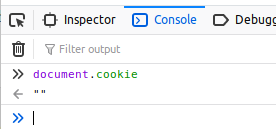

### Add a cookie from the browser
The syntax to add a cookie from the client JavaScript API is:

```javascript
document.cookie = "name=value"
```

Each time you do this, a new cookie will be added. You can see all cookies stored in the browser session by just logging `document.cookie`.


From console in Firefox, type the following to add a cookie:

```javascript
document.cookie = "clientCookie=vanilla"
```

Now from the browser console, look at `document.cookie`:

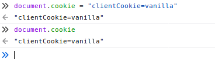

Add another one:

```javascript
document.cookie = "clientCookie2=coconut"
```

And check `document.cookie` again:

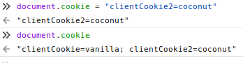

See that it didn't overwrite `document.cookie`, it added to it.

### Check the cookies from the server
Refresh the browser (the server should still be running). What do you see?

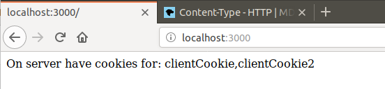

And from the server console:

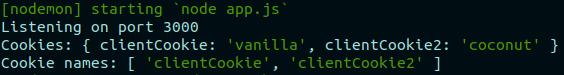

### Overwriting cookies from the client
We can overwrite an existing named cookie from the client by just setting its value to something new:

```javascript
document.cookie = "clientCookie=strawberry"
```

Check `document.cookie` in the browser console:

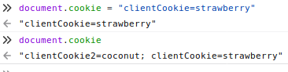

If we refresh the browser - the changed cookie is sent to the server:

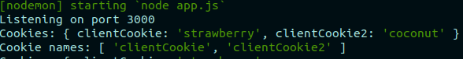

This uncovers one security issue with cookies!

## Set a cookie from the server
We have seen that we will receive cookies on our server set during this browser session from the client. We can also send cookies from the server (which is normally how cookies come to be).

We can send a cookie with a response with `res.cookie`. At a minimum, we have to pass two parameters - the name and the value:

```javascript
res.cookie("name", "value");
```

In the route handling for GET on '/', add the following to create and send a cookie from the server (before you send the response):

```javascript
  // Send a cookie from the server
  res.cookie("serverCookie", "chocolate");

  // Send cookie names back to client
  res.setHeader("Content-type", "text/html");
  if (cookieNames.length > 0) res.send(`On server have cookies for: ${cookieNames}`);
  else res.send("Got no cookies!");
```

Now, refresh the browser. The response sent back still only shows the 2 client cookies - because on the first request to this route, the server cookie isn't in the request. However, look at `document.cookie` in the browser now:

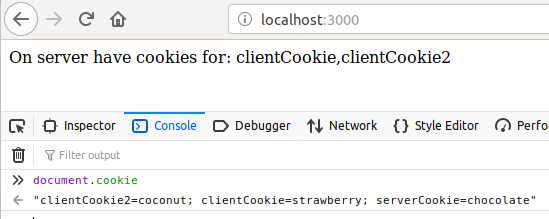

And if we refresh again - we'll see the `serverCookie` in the list of cookies that come with the client request:


### Only send the server cookie once
We only have to send the cookie from the server once, because once it is sent, the client will send it back as long as the session is open (or longer if we specify `maxAge` or `expires`).

Add this check to the '/' route handling:

```javascript
// Send a cookie from the server if we haven't
  if (!cookieNames.includes("serverCookie")) {
    res.cookie("serverCookie", "chocolate");
  }
```

This shouldn't change anything about the outcome we see. Refresh the browser a couple of times, and see that the client and server show the same outcomes.

### Changing a server cookie from the client with document.cookie
We could change the serverCookie from the client, from the console (or a script) ...

```javascript
document.cookie = "serverCookie=caramel"
```

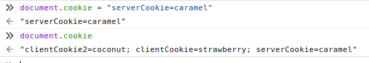

And when we refresh ...

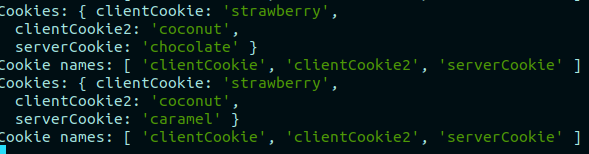

**This is why we need httpOnly and signed cookies.**

## Clearing cookies from the server
Express.js gives us a way to clear a cookie from the server. We can clear any cookie we like that comes with the request object using: 
```javascript
req.clearCookie("name");
```
### clearCookie route
Implement a clearCookie route that takes a cookie name as a query string.

```javascript
app.get('/clearCookie', (req, res) => {
  console.log("In clearCookie got cookies:", req.cookies);
  console.log("got query string", req.query);

  let cookieName = req.query["name"];
  res.clearCookie(cookieName);
  res.send(`Cleared cookie: ${cookieName}`);
});
```

Use the new route to clear the serverCookie by typing the following url into Firefox: `http://localhost:3000/clearCookie?name=serverCookie`, and verify that `serverCookie` is no longer in `document.cookie`.

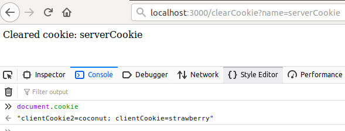

Verify that if you visit the '/' route again from Firefox, that only the 2 clientCookies are seen on the server:

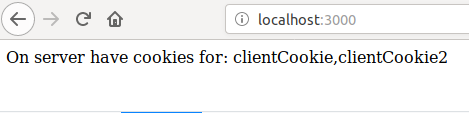


## Using httpOnly from the server
We can send httpOnly as an option when we send a cookie with a server response. It is specified in an options object as the third argument to `res.cookie`.

Update the call to `res.cookie` to specify httpOnly for our serverCookie:

```javascript
// Send a cookie from the server if we haven't
if (!cookieNames.includes("serverCookie")) {
  res.cookie("serverCookie", "chocolate", {
    httpOnly: true
  });
}
```

Refresh Firefox (which should be pointed at the '/' route). Notice that the server indicates that three cookies are found:

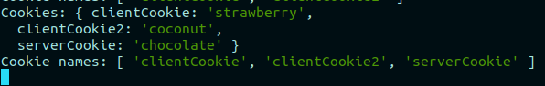

But we can't see the `serverCookie` anymore on the client with `document.cookie`:

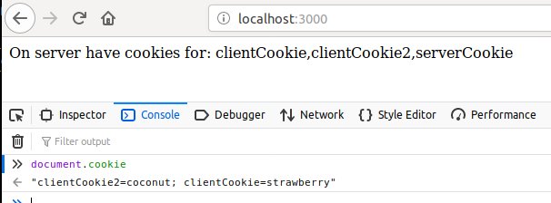

We also can't change this cookie from the client anymore using document.cookie. Try it!

## Signing a cookie from the server
For additional protection, we could sign the cookie from the server. So that we can see how this works (so we can try to manipulate the server cookie from the client), we'll remove the httpOnly flag from the cookie options, but we'll make the cookie signed.

To use cookie-parser to read our signed cookie, we need to specify the secret we'll use when when apply the middleware. This secret can be any string.

Change the line in app.js that uses cookieParser to specify a secret:

```javascript
app.use(cookieParser("Coding is fun"));
```

And when we created the cookie, instead of using `httpOnly`, we'll use `signed` in the options.

```javascript
// Send a signed cookie from the server if we haven't
if (!cookieNames.includes("serverCookie")) {
  res.cookie("serverCookie", "chocolate", {
    signed: true
  });
}
```

Let's clear the serverCookie before testing using our clearCookie route.

Then go back to the '/' route to regenerate the serverCookie, this time signed.

The first time we go to '/' without the serverCookie, so we won't see it logged on the server as part of the req object, but if we look at document.cookie now in Firefox, we see the signed serverCookie:

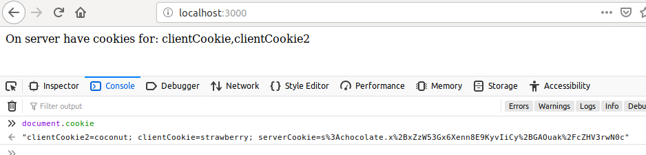

Refresh the page. Do we see the serverCookie mentioned on the server now? We don't. We have to access signed cookies using `req.signedCookies` with `cookie-parser`.

Make the following change to the server code:

```javascript
app.get('/', (req, res) => {

  // Log cookies received on server (unsigned)
  console.log("Cookies:", req.cookies);
  let cookies = req.cookies;
  let cookieNames = Object.keys(cookies);
  console.log("Cookie names:", cookieNames);

  console.log("Signed cookies:", req.signedCookies);
  let signedCookieNames = Object.keys(req.signedCookies);
  console.log("Signed cookie names:", signedCookieNames);

  // Send a signed cookie from the server if we haven't
  if (!signedCookieNames.includes("serverCookie")) {
    res.cookie("serverCookie", "chocolate", {
      signed: true
    });
  }

  // Send cookie names back to client
  res.setHeader("Content-type", "text/html");
  if (cookieNames.length > 0) res.send(`On server have cookies for: ${cookieNames} and signed: ${signedCookieNames}`);
  else res.send("Got no cookies!");
});
```

Refresh from Firefox and see that the server logs and responds with information about the signed cookie now.

Even if we try to change it from the client now, we won't be successful. You can give it a try!