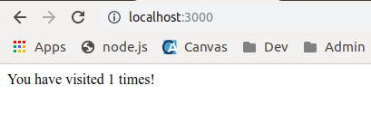
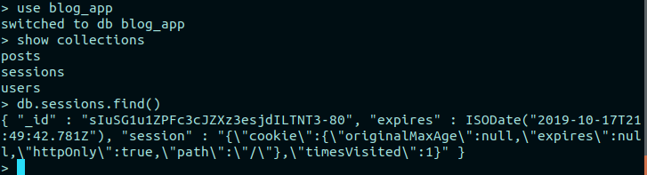
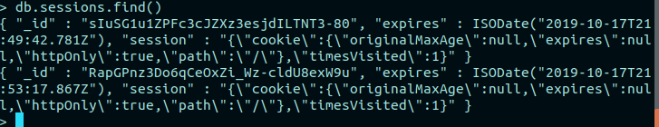

# Sessions

A session between a client and server exists while there is a connection between the two. The session holds the state of the application, which is temporary data that can describe the user, the client, and the server, and which is useful while a user is interacting with the application.

In this lesson, you will learn about session data, how it can be stored, and implement server-side session storage using express-session and connect-mongo to use a database store.

- [Sessions](#sessions)
  - [Resources](#resources)
  - [Client-side vs server-side session storage](#client-side-vs-server-side-session-storage)
    - [Server-side session storage](#server-side-session-storage)
    - [Client-side session storage](#client-side-session-storage)
  - [express-session](#express-session)
  - [Using a session to store information](#using-a-session-to-store-information)
  - [Keeping track of user hits on the app root route](#keeping-track-of-user-hits-on-the-app-root-route)
  - [Adding a session store](#adding-a-session-store)
  - [Expiring sessions](#expiring-sessions)
  - [Challenges](#challenges)

## Resources

- [HTTP session](https://developer.mozilla.org/en-US/docs/Web/HTTP/Session)
- [Client session vs server session](http://www.rodsonluo.com/client-session-vs-server-session)

## Client-side vs server-side session storage

Session data can be stored on the client or the server, and which to use depends on the situation. Like anything there are pros and cons for each.

### Server-side session storage

It is typically easier to secure information stored on the server, so server-side sessions are often more secure - there is no need to send the user information with each request when it is stored on the server.

If session data doesn't have to be sent with the client with each communication, it also results in smaller cookie sizes which will improve the performance of network transfer. However, if the storage is central and used by multiple server instances, it may take longer to retrieve the information from the session store (resulting in increased latency).

### Client-side session storage

If session storage is on the client, there is no need to maintain storage on the server, which is simpler to implement and maintain. This is the biggest advantage and why this solution is often chosen.

Security is one of the biggest concerns with client-side storage - strong encryption is required because all user details will be stored on the client. Cookie size will be bigger, because the session data will be sent to the server with each request.

## express-session

For our blog app, we will use `express-session` to implement server-side session storage, which we will use to track authentication and authorization data when we cover that topic. The express-session module handles some of the work for us, such as:

- sending server session cookies as httpOnly and signed by default
- generating unique session ids for each client user session
- integrating with session storage to store and retrieve session data


Install `express-session`:

```
npm i express-session
```

We can use the session property on any request object (`req.session`) to store data that is particular to that session. For example, we could use it to store how many times the user has visited a particular url on our server, or whether or not the user associated with the session is authenticated.

By default, this information is stored in memory on the server. This is typical for development, but not a good practice for production. In production, session data is stored in one of these ways:

- in a database (i.e., [Mongo](https://www.npmjs.com/package/connect-mongo)),
- in the server file system (i.e., using [filestore](https://www.npmjs.com/package/session-file-store)),
- using a memory-cache system (i.e., [Redis](https://www.npmjs.com/package/connect-redis) or [Memcached](https://www.npmjs.com/package/connect-memcached))

The express-session github has a [list of many compatible store options](https://github.com/expressjs/session#compatible-session-stores)

For now, we'll set up our app to use express-session with in memory storage. Add this to our app.js:

app.js

```javascript
const session = require("express-session")

app.use(
	session({
		// resave and saveUninitialized set to false for deprecation warnings
		secret: "Express is awesome",
		resave: false,
		saveUninitialized: false
	})
)
```

Note that `secret` is the only required option for initialisation of the express-session. As mentioned, it's used to sign our cookies. The other two options shown are required to resolve some deprecation warnings.

We can choose to set a `maxAge` for our session cookies, if for example we want to force a user to re-authenticate after some period of time. We'll look at this later in the lesson.

## Using a session to store information

Storing information in the session is as simple as adding a key and assigning a value to `req.session`. For example, we could store how many times a user has visited a particular page in our application.

## Keeping track of user hits on the app root route

Let's add some code that will track how many times we've visited the '/' page. This code will go in the implementation of GET on the '/' route in app.js.

app.js

```javascript
app.get("/", (req, res) => {
	console.log("get on /")
	req.session.timesVisited ? req.session.timesVisited++ : (req.session.timesVisited = 1)
	res.send(`You have visited ${req.session.timesVisited} times!`)
})
```

Now if we start the server, and go to `http://localhost:3000`, we'll see the message:



And every time we refresh, it gets updated. If we restart the server, or open the connection from another client (another browser or Postman), it starts a new session and the count restarts at 1.

## Adding a session store

The advantages of using in-memory session storage is that it is easy and fast. One disadvantage is that it isn't scalable (too many sessions and memory could be overloaded). Another disadvantage is that our session data is lost every time our server restarts (and sometimes this isn't desirable, for example if our server restarts, we may not want to log out all of our clients).

Since we are using MongoDB, we can easily implement a Mongo session store with `connect-mongo`.

Install it:

```
npm i connect-mongo
```

To use it, we just have to require it and pass it our express-session varaible, and then include it as a parameter to session when we use it in the app.js:

app.js

```javascript
const MongoStore = require("connect-mongo")(session)

app.use(
	session({
		// resave and saveUninitialized set to false for deprecation warnings
		secret: "Express is awesome",
		resave: false,
		saveUninitialized: false,
		store: new MongoStore({
			mongooseConnection: mongoose.connection
		})
	})
)
```

It's that simple!

If we restart the server, and visit the app home page again, we can see the session stored in MongoDB.

From a terminal session, run the mongo shell. After you visit the home page from a browser, look in the blog_app database from the mongo shell:

```
mongo
use blog_app
show collections
db.sessions.find()
```



Connect from Postman - send a GET request on '/'. Now look in the sessions collection:

```
db.sessions.find()
```



## Expiring sessions

The way we have things implemented right now, our sessions never expire. This can be a security concern for users that don't log out and leave their computer unsecured, allowing someone else to take advantage of their login session. It also means that we'll have sessions no longer in use that are hanging out in our database collection.

We can set a reasonable timeout, such as 30 minutes (1800000 ms) using the `maxAge` property on the session cookie. We can specify it like this:

app.js

```javascript
app.use(
	session({
		// resave and saveUninitialized set to false for deprecation warnings
		secret: "Express is awesome",
		resave: false,
		saveUninitialized: false,
		cookie: {
			maxAge: 1800000
		},
		store: new MongoStore({
			mongooseConnection: mongoose.connection
		})
	})
)
```

When the session cookie expires, any authentication using the session will also expire, and the session will be deleted from the database store.

## Challenges
Use the session object to keep track of the last time the user makes a new post, and how many posts have been made during this session. We could use this information to detect when a bot is flooding our server with new posts. 

1. Implement a session attribute called 'lastPosted' in the `makePost` function that is updated with the current date and time when a user makes a new post. 
2. Implement a session attribute called 'timesPosted' that is incremented every time the user makes a post.
3. Log the new session attributes every time they are updated.
4. Test your implementation. Check the session objects in mongo to make sure you see what you expect there, as well as in the console log on the server.
