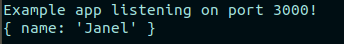
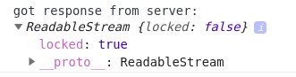
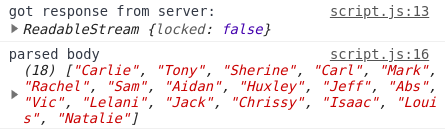
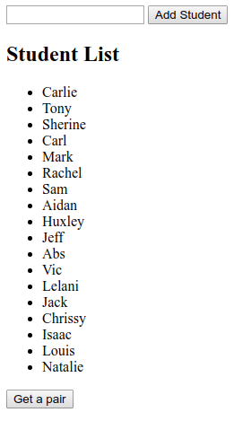
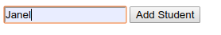
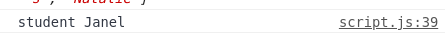

# Express.js

## Resources
[express.js](https://expressjs.com/)
[HTTP status dogs](https://httpstatusdogs.com/)
[Practical guide to CORS](https://medium.com/@xinganwang/a-practical-guide-to-cors-51e8fd329a1f)

- [Express.js](#expressjs)
  - [Resources](#resources)
  - [Express](#express)
    - [Why use express.js?](#why-use-expressjs)
  - [Setup our environment](#setup-our-environment)
  - [Updating our routes using express](#updating-our-routes-using-express)
  - [Processing the POST data with express](#processing-the-post-data-with-express)
  - [Middleware](#middleware)
    - [body-parser](#body-parser)
    - [Using body-parser to parse form-urlencoded content](#using-body-parser-to-parse-form-urlencoded-content)
  - [Defining our own middleware](#defining-our-own-middleware)
    - [Using next() in middleware functions](#using-next-in-middleware-functions)
  - [cors middleware - Enabling cross-origin resource sharing](#cors-middleware---enabling-cross-origin-resource-sharing)
  - [Challenge](#challenge)

## Express
Express is a fast, unopinionated, minimalist web framework for Node.js

### Why use express.js?

Our node.js http server works, and we kept it pretty clean, but there are some issues:

* Gets messy (unorganised) the more routes we add - it isn't very modular.
* Hard to do dynamic routes
* No where to properly put our validation
* No easy way to get the body of our request
* Cumbersome to put together a proper response (need to write our own headers)

Express.js gives us a mucheasier way to manage our web server. 

Let's take a look at how we can setup our web server using Express instead of the HTTP module that comes packaged with Node. First we need to `npm init` install express, and create our `script` alias.

## Setup our environment
Remember this part? 
```
npm init
```

Install express:
```
npm i express
```

Lets create a new file to create our express server in called express.js

express.js

```javascript
const express = require("express");

const app = express();
const port = 3000;

app.get("/", (req, res) => {
    res.send("Hello World!");
});

app.listen(port, () => console.log(`Example app listening on port ${port}!`));
```

To get all the goodness from `forever` and `nodemon` we will also have to update our scripts in `package.json`. Lets create a new script and name it `express-server`.

package.json

```javascript
{
    "name": "app",
    "version": "1.0.0",
    "description": "",
    "main": "app.js",
    "scripts": {
        "test": "echo \"Error: no test specified\" && exit 1",
        "express-server": "forever -c \"nodemon --exitcrash -L\" express.js"
    },
    "author": "",
    "license": "ISC",
    "devDependencies": {
        "nodemon": "^1.18.6”,
        "forever": "^0.15.3"
    }
}
```

There we go we now have an express server running.

## Updating our routes using express
Now we can implement our student app routes using express.

express.js

```javascript
const express = require("express");

const app = express();
const port = 3000;

const fs = require('fs');

const readStudentData = (file) => {
  let students = fs.readFileSync(file, 'utf8').split('\n');
  return students;
};

const persistStudentData = (file, students) => {
  fs.writeFileSync(file, students.join('\n'));
  console.log("updated students:", students)
  return students;
};

function randomPair() {
  let s1Ind = Math.floor(Math.random() * students.length);
  let s2Ind = Math.floor(Math.random() * students.length);
  // Return a JSON object with an array
  return {
    pair: [students[s1Ind], students[s2Ind]]
  };
}

let students = [];

students = readStudentData('students.txt');

app.get("/", (req, res) => {
    res.send(randomPair());
});

app.get("/students", (req, res) => {
    res.send(students);
});

app.post("/students", (req, res) => {
    // Still need to add code to add the student that is sent
    res.send(students);
});

app.listen(port, () => console.log(`Example app listening on port ${port}!`));
```

Look at how clean express has made our code! Also we did not have to handle the 404 no route found because express automatically comes with a default error handling middleware.

## Processing the POST data with express
Remember how mess it was to process the stream data from the POST request with the http module in the node.js lesson? This is one of the big wins we get with express.js. Let's look again at the request that comes to the server when we send a student from Postman.

express.js

```javascript
app.post("/students", (req, res) => {
    // Log the request
    console.log(req);
    // Still need to add code to add the student that is sent
    res.send(students);
});
```
There is a piece of middleware we can use with express.js that will parse the request body for us, as json or a url encoded string. 

What is middleware?

## Middleware

To put it simply middleware is code that runs in the ‘middle’. Now this can get a little confusing because we can run our middleware really at any point. If we take a look at our code as it stands right now all the code is synchronous meaning the application is going to read in order so if want to add in some middleware before or after the routes we can literally place that code before or after all of the route calls using **app.use()**.

A commonly used middleware and one we are going to need to complete our POST route is **body-parser**. 

### body-parser

```
npm i body-parser
```

Now lets import this module into our code use it.

express.js

```javascript
const express = require("express");
const bodyParser = require('body-parser');

const app = express();
const port = 3000;

// Use body-parser to parse application/json
app.use(bodyParser.json());
```

Now we can parse data coming into our server as json. 

This middleware parses the data and saves it to the request as a **body** property, which we can now view using `req.body`. 

Notice how this middleware had to be defined before the routes because we need it to run before we access the request object on any particular route. If we defined this middleware after the routes it would not have run in time.

---
### Using body-parser to parse form-urlencoded content
If we expect form-urlencoded content from the client, we would also include this middleware from body-parser:
```javascript
// parse application/x-www-form-urlencoded
app.use(bodyParser.urlencoded());
```
---

Let's log the req.body so we can see what's there:

```javascript
app.post("/students", (req, res) => {
  console.log(req.body);
  // Still need to add code to add the student that is sent
  res.send(students);
});
```


OMG! Magic!

Lets use this data now to complete the functionality for our /student POST route.

express.js

```javascript
// Take the name from the req.body property and add it the end of the students array. 
//The route should respond with a 201 status and the modified array
app.post("/students", (req, res) => {
    students.push(req.body.name);
    // Add persisting the new student
    persistStudentData("students.txt", students);
    res.status(201);
    res.send(students);
});
```

Note that we use the `status` method on the result to send the status code. When we create a resource, we should send back the 201 status code. You can remind yourself of the proper status codes using [HTTP status dogs](https://httpstatusdogs.com/).

We send the data back with the `send` method.

Test it! Make sure our POST request is updating the list of students.

## Defining our own middleware
One more note about middleware before we move on is that we can define it for a specific route as well. Lets add some custom middleware to our /students POST route that will always log the req.body.

express.js

```javascript
// Custom logging middleware
function logReqBody(req, res, next) {
    console.log(req.body);
    next();
}
app.post("/students", logReqBody, 
    (req, res) => {
        students.push(req.body.name);
        res.status(201)
        res.send(students);
    }
);
```

We define the middleware function `logReqBody`, which just logs the req.body. 

Now we can include that middleware function where we like, such as for the `post /students` route as shown above. To include it, we just pass it as an argument before the callback function that executes on the request.

We can use as many middleware functions as we like in this way, just chaining them one after the other in a comma-separated list, in the order we want them to be executed. 

### Using next() in middleware functions

If we want to execute multiple functions (middleware) before we complete our response to a request, we need to use the `next()` function to indicate to express that we are not done, and the request and response should be passed on to the next function in the response chain. 

If we want to pass information on from our middleware to the next function in the chain, we can just attach it to the req object.

For example, we could define our function to get a random pair of students as middleware, and we could call it when we are responding to GET on '/'. We can pass the random pair of students in a new property on req:

```javascript
function randomPair(req, res, next) {
  let s1Ind = Math.floor(Math.random() * students.length);
  let s2Ind = Math.floor(Math.random() * students.length);
  req.pair = {
    pair: [students[s1Ind], students[s2Ind]]
  };
  next();
}
```

And where we are defining the GET on '/', we would use the middleware, and get the pair to send back from the request object:

```javascript
app.get("/", randomPair, (req, res) => {
  res.send(req.pair);
});
```

Make sure our code still works with this change.

## cors middleware - Enabling cross-origin resource sharing
If we want to allow clients to use our server, we need to deal with Cross-Origin Resource Sharing (CORS). Unless our client and server are running on the same host and port, we will get CORS errors when we try to transfer information between client and server.

There is quite a lot to understand about how this works, and I will leave it to you to explore. [This is a nice post to get you started](https://medium.com/@xinganwang/a-practical-guide-to-cors-51e8fd329a1f).

So that we can focus on other things, we will just use the cors module available for express and use it as middleware to basically open up our server to any client.

First we will install cors in our app project:
```npm i cors```

Next we will require it and use it at the top of our app. It's important that we use this middleware before we do any route handling:

express.js
```javascript
const cors = require("cors");

const app = express();
const port = 3000;

// use cors if we want to play with a client
app.use(cors());

```

## Creating a client
Now we can have a play with creating a client! I'll get you started, and you can complete the client as a challenge.

Start by creating a client directory outside of our express project directory. In that directory, create an index.html and script.js.

In the index.html, add the scaffold:

index.html
```html
<!DOCTYPE html>
<html lang="en">

<head>
  <meta charset="UTF-8">
  <meta name="viewport" content="width=device-width, initial-scale=1.0">
  <meta http-equiv="X-UA-Compatible" content="ie=edge">
  <title>Document</title>
</head>

<body>
  <form id="add-student-form">
    <input type="text" name="student-name">
    <input type="submit" value="Add Student">
  </form>
  <section id="student-list"></section>
  <form>
    <input id="show-pair" type="submit" value="Get a pair">
  </form>
  <section id="student-pair"></section>
  <script src="script.js"></script>
</body>

</html>
```

We have a simple text field and button to add a student, a section to show the student list, and a button to display a random pair of students. The rest we will add with client-side javascript!

### Setting up for connection to our server
Create a variable to store the url for our server. It should include the hostname and port, just like we type it into a browser or Postman:

script.js
```javascript
let serverUrl = "http://localhost:3000/";
```

Set up another variable called `studentsUrl`:

script.js
```javascript
let studentsUrl = serverUrl + "students";
```

### Display a list of students
*What kind of request do we need to send to the server to get a list of students?*

We need to send a `GET` request on the `studentsUrl`.

We can use `fetch` to do this. Remember that `fetch` *returns a Promise*. We will have to resolve the promise, and call a function with the result to display the list of students.

First, let's define a function that will display a list of students returned by the server. This one is simple. You can do some fancier DOM elements and styling if you like when you work on the challenge:

script.js
```javascript
function displayStudentList(students) {
  let section = document.querySelector("#student-list");
  let h1 = document.createElement("h1");
  h1.textContent = "Student List";
  let ul = document.createElement("ul");
  for (let student of students) {
    let li = document.createElement("li");
    li.textContent = student;
    ul.appendChild(li);
  }
  section.appendChild(h1);
  section.appendChild(ul);
}
```

This function will be passed the array of students, but we still have to get that from the server. Let's define a function called `getStudentList()` to do this. We will use fetch and use the `studentsUrl`. We need to resolve the promise returned (with `.then`), and handle a promise rejection (with `.catch`):

script.js
```javascript
function getStudentList() {
    fetch(studentsUrl).then((response) => {

    }).catch((err) => console.log(err));
}
```

*What should we do when the promise resolves?*

A good first step is to check the status of the response:

script.js
```javascript
function getStudentList() {
    fetch(studentsUrl).then((response) => {
        if(response.status !== 200) {
            console.log("Got an error from the server:", response.status);
            return;
        }
    }).catch((err) => console.log(err));
}
```

If we get a 200 status back, we should also have a list of students, so how do we get to it? Let's log the response.body to see what we have:

script.js
```javascript
function getStudentList() {
    fetch(studentsUrl).then((response) => {
        if(response.status !== 200) {
            console.log("Got an error from the server:", response.status);
            return;
        }
        console.log("got response from server:", response.body);
    }).catch((err) => console.log(err));
}
```
To test this, let's add a call to the function in our script:

script.js
```javascript
getStudentList();
```

Hmm ... a readable stream ...


Our server is returning json, and in order to get to the content of the body, we can use the json() function on the response. This is asynchronous code that also returns a promise, so we need to resolve it also, like this:

```javascript
function getStudentList() {
  fetch(studentsUrl)
    .then((response) => {
      if (response.status !== 200) {
        console.log("There was a problem on the server. Response status is:", response.status);
        return;
      }
      console.log("got response from server:", response.body)
      // Parse the response
      response.json().then((students) => {
        console.log("parsed body", students)
      });
    }).catch(err => console.log(err));
}
```


Now, all we have left to do is to pass this data to our `displayStudentList` function!
```javascript
function getStudentList() {
  fetch(studentsUrl)
    .then((response) => {
      if (response.status !== 200) {
        console.log("There was a problem on the server. Response status is:", response.status);
        return;
      }
      console.log("got response from server:", response.body)
      // Parse the response
      response.json().then((body) => {
        console.log("parsed body", body)
        displayStudentList(body);
      });
    }).catch(err => console.log(err));
}
```



Let's look at one more thing together - how we send a post request to the server. 

### Adding a student to the list
We'll need to do a few things to enable this:
1. Add a listener to the form submission
2. Define a callback function for that event that will send the new student name to the server to add with a POST request

**Add a listener to the form submission**
We've done this before:

script.js
```javascript
let newStudentForm = document.getElementById("add-student-form");
newStudentForm.addEventListener("submit", postNewStudent);
```

**Define postNewStudent to post the new name**
Now to add the function `postNewStudent`. The first thing we'll do is preventDefault, and get the new student name to add from the form field:

script.js
```javascript
function postNewStudent(event) {
  event.preventDefault();
  let textField = event.target.elements[0];
  let student = textField.value;
  console.log("student", student)
}
```
Let's make sure that much works:





This proves that at least our event handling is working, and we can get the name from the field.

We will use fetch again to make the call to our server, but this time we'll specify some options to indicate three things:
* that we want to use `POST` method (the default is `GET`), and 
* to set the `Content-type` in the header to `application/json` (this is what our server expects)
* the body of our request (the student name typed into the form, in the expected strigified JSON format)
We'll define the options like this:

script.js
```javascript
function postNewStudent(event) {
      let options = {
    method: "POST",
    headers: {
      "Content-type": "application/json"
    },
    body: JSON.stringify({
      "name": student
    })
  };
}
```

We'll call fetch with the `studentsUrl` and the options, resolve the promise that is returned, and handle any rejection:

script.js
```javascript
  fetch(studentsUrl, options).then((response) => {
    if (response.status !== 201) {
      console.log("There was a problem on the server:", response.status);
    }
    console.log("Added student");
    // Clear the text field
    textField.value = "";
  }).catch((err) => console.log(err));
```

When we test this, we can see the logged message that the student was added, but we don't see the list updated. *Why?*

We are preventing reload of the page. We could call displayStudentList with the list of students, but we'll have to get that from the response like we did for the GET request on '/students'. Let's define a `jsonCallback` function that does this so we can use it in both places:

script.js
```javascript
function jsonCallback(response) {
  console.log("parsed body", response)
  displayStudentList(response);
}
```
Modify `getStudentList` to use this function:

script.js
```javascript
function getStudentList() {
  fetch(studentsUrl)
    .then((response) => {
      if (response.status !== 200) {
        console.log("There was a problem on the server. Response status is:", response.status);
        return;
      }
      // Parse the response
      response.json().then(jsonCallback);
    }).catch(err => console.log(err));
}
```

And add this to the fetch promise handling in `postNewStudent`:

script.js
```javascript
  fetch(studentsUrl, options).then((response) => {
    if (response.status !== 201) {
      console.log("There was a problem on the server:", response.status);
    }
    console.log("Added student");
    // Clear the text field
    textField.value = "";
    response.json().then(jsonCallback)
  }).catch((err) => console.log(err));
```

Test it!


Oh-oh... *What happened? How can we fix it?*

The fix is easy enough - we just need to set innerHTML to null in the student list section at the top of `displayStudentList`:

script.js
```javascript
function displayStudentList(students) {
  let section = document.querySelector("#student-list");
  section.innerHTML = null;
  ...
}
```

Wonderful! We did it! I'll leave the rest of the implementation to you for a challenge

## Challenge
Finish implementing the client. Add a listener to the `Get pair` button on the page, and have it display a random pair of students retrieved from the server. Look at how we implemented display of the student list for tips!
