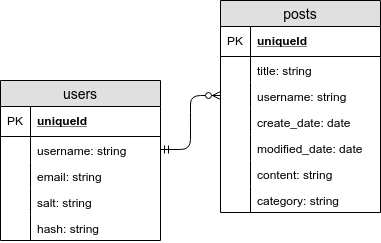
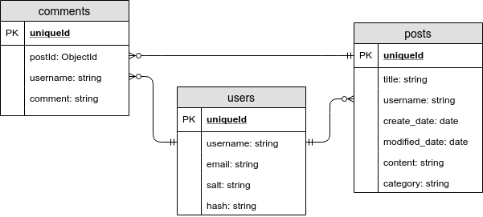
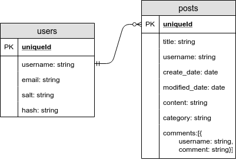
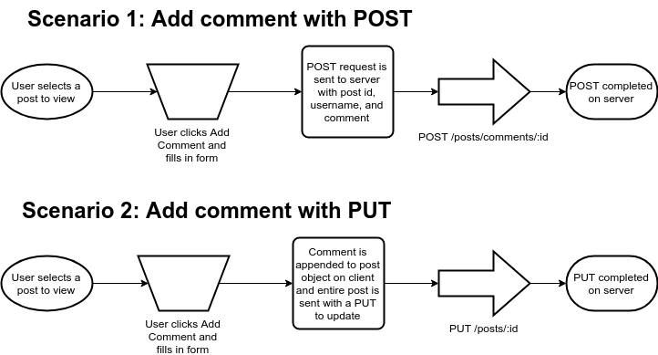
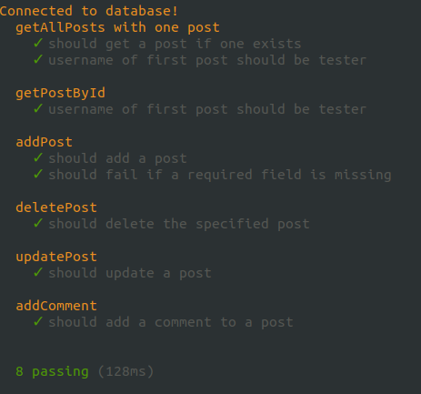
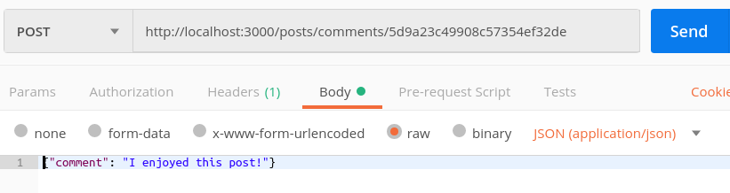
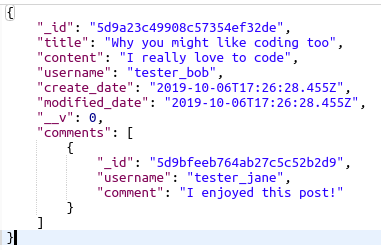
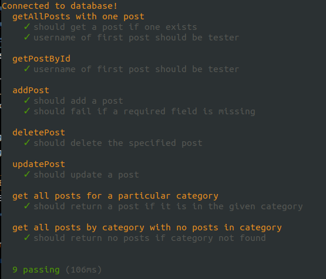

# Document database design and model best practices

When we are using a noSQL or non-relational database like the document database we get with MongoDB, we have to rethink our choices for database design and when to normalise data. In many cases it is better to use a denormalised design. In this lesson we will discuss the data modeling considerations and choices for implementing relations in MongoDB.

In this lesson we will also look at best practices for data model implementations, including the use of the fat controller/skinny model paradigm we learned about with Rails.

- [Document database design and model best practices](#document-database-design-and-model-best-practices)
  - [References](#references)
  - [Normalised vs denormalised data design](#normalised-vs-denormalised-data-design)
    - [Some additional considerations:](#some-additional-considerations)
  - [Adding more relations to our data model](#adding-more-relations-to-our-data-model)
  - [Adding comments to the blog app](#adding-comments-to-the-blog-app)
  - [Adding comments - embedded data vs references](#adding-comments---embedded-data-vs-references)
  - [User by reference](#user-by-reference)
  - [Indexing](#indexing)
  - [Adding comments](#adding-comments)
  - [How users will add comments](#how-users-will-add-comments)
    - [Add controller and route for POST /posts/comments/:postId](#add-controller-and-route-for-post-postscommentspostid)
  - [Schema instance methods and static methods](#schema-instance-methods-and-static-methods)
    - [Instance methods](#instance-methods)
    - [Static methods](#static-methods)
  - [Filtering results by category](#filtering-results-by-category)
    - [Writing the tests for category filtering on getAllPosts](#writing-the-tests-for-category-filtering-on-getallposts)
  - [Implementing findByCategory](#implementing-findbycategory)
  - [Challenge - findByUsername](#challenge---findbyusername)
  - [Challenge - more comments routes](#challenge---more-comments-routes)

## References
- [MongoDB data modeling introduction](https://docs.mongodb.com/manual/core/data-modeling-introduction/)
- [MongoDB data model design - embedded vs references](https://docs.mongodb.com/manual/core/data-model-design/)
- [Indexes in MongoDB](https://docs.mongodb.com/manual/indexes/)
- [Mongoose schema methods](https://mongoosejs.com/docs/guide.html#methods)


## Normalised vs denormalised data design
We learned about normalisation with Rails and PostgresSQL. In general for relational (SQL) databases, normalisation is preferable because the reduction of duplication makes it easier to maintain data, and requires less storage space. SQL databases are designed to support normalisation, providing atomicity (transactional) writes of connected data in different tables, and performant joining implementations that make lookups across multiple tables fast.

When we are working with a noSQL (non-relational) database like MongoDB, it is often a good practice to denormalise in many cases. MongoDB provides two choices when representing relations between data entities: **embedded data** (denormalised) and **references** (normalised).

In general, it is best to used embedded data when:
- You have [one-to-one relationships between entities](https://docs.mongodb.com/manual/tutorial/model-embedded-one-to-one-relationships-between-documents/#data-modeling-example-one-to-one). 
- You have [one-to-many relationships between entities](https://docs.mongodb.com/manual/tutorial/model-embedded-one-to-many-relationships-between-documents/#data-modeling-example-one-to-many). In these relationships the “many” or child documents always appear with or are viewed in the context of the “one” or parent documents.
- The repeated, embedded data is read more than written, because read performace is faster with embedded documents (only requires a single lookup), but writing the same change to multiple documents, where embedded duplicated data is updated, is slower that writing it to a single document in a separate collection.

### Some additional considerations:
- *Size of data* - The data size limit for a single document in MongoDB is the maximum BSON document size, which is **16 MB**. This has to be considered for embedded data documents. 
- *Atomicity of write operations*. In MongoDB, a single document write is atomic (this means that the write completes for all fields, or no fields are updated). **Embedded data** combines all related data in a single document. Writing multiple documents connected through **references** is not atomic (which means that some documents may be updated and others may not be updated, if for example, some error interrupts the update - which can lead to data inconsistencies).
  - Multi-document transactions are possible, but has a greater performance cost

## Adding more relations to our data model
Our current data model looks like this:



We have blog posts and users, and they are related to each other with the username field. A post belongs to a user and one user can have many posts, so we have a one to many relation between the two collections.

## Adding comments to the blog app

If we allow users to make comments on other user's posts, we introduce another one to many relation between post and comments (a comment belongs to a post and a post can have many comments). We also introduce a one to many relation between user and comments (a comment belongs to a user, and a user can make many comments). It also creates a many to many relation between users and posts through comments (a user can comment on many posts, and a post can be commented on by many users).



## Adding comments - embedded data vs references
We need to consider how we will use the data in our application. We need to consider the user stories, when we are writing duplicated data, and when we are reading related data. In these stories (W) indicates write is required, and (R) indicates read is required:

1.  (W) As a user, I can add a blog post
2.  (R) As a user, I can view a single post
3.  (W) As a user, I can update my blog post
4.  (W) As a user, I can delete my blog post
5.  (R) As a user, I can view my blog posts
6.  (R) As a user, I can view all blog posts
7.  (R) As a user, I can view all blog posts by category
8.  (R) As a user, I can view all blog posts by another user
9.  (W) As a user, I can comment on another user's post
10. (R) As a user, I can view a single comment
11. (W) As a user, I can update my comment on a post
12. (W) As a user, I can delete my comment on a post
13. (R) As a user, I can read all comments on a post
14. (W) As an admin, I can delete any post
15. (W) As an admin, I can delete any comment
16. (W) As an admin, I can block/unblock a user
17. (R) As an blocked user, I cannot create, update, or delete posts or comments.

In the cases where we are writing comments(#8,10,11), since each comment on a post is unique, there is no duplicated data, so it makes sense to embed comments in posts. Our biggest concern with this is size, so let's consider that. 

There are roughly 1000 characters in 1KB. If we consider a page of text to be an average of 3000 characters, that means that about 350 pages of text requires 1MB. That means we could store over 5000 pages of text in a single document. If we assume an average post is 5 pages, and an average comment is 1 page (which is pretty generous), we would still have room for A LOT OF COMMENTS with this limitation, so I think it's safe. Even if we decide to store an image for a post, we should have plenty of room (and we could put limitations for the size of the image if we want to do that):



If you can imagine that we might have thousands of rather long comments on a single post, or if you could imagine a future enhancement that would store a lot more data in a post, you could choose to store comments in a separate document.

## User by reference

We have implemented the relation between posts and users (post creator), and comments and users (comment creator) as references. We refer to the username in the post or comment, and if we needed more information about that user, we would have to look it up. Fortunately, the only user stories that require looking up user data is #15 and #16. Neither require cross-referencing users and specific posts or comments.

For user story #5, a user can view all of their own posts. If we tried to store all posts made by a user as embedded data (and all of the post comments), we would probably extend the single document size limit, and it would only benefit that one case.  Using a reference means that we will have to do a lookup on the posts collection where username matches that of the currently logged in user. This is OK, because it's still just a lookup on a single table. We can imrove performance on that lookup by making the username field on posts an [indexed field](#indexing).

We don't have a user story to view all comments made by a single user, because that isn't a very useful feature. If it were, we would have to consider the difficulty of finding embedded comments made by a single user for every blog post, and we might rethink our design.

## Indexing
There are a lot of indexing options with MongoDB. [Read more about them here](https://docs.mongodb.com/manual/indexes/). We will create a couple of simple indexes on the posts collection to speed up lookups for these user stories:
- (R) As a user, I can view my blog posts
- (R) As a user, I can view all blog posts by another user
- (R) As a user, I can view blog posts by category

This would be faster if we add indexes for `username` and `category`. Let's also assume that we will want to sort these entries by most recently modified first. We could add the following [compound indexes](https://docs.mongodb.com/manual/core/index-compound/):

mongo shell
```javascript
use blog_app
db.posts.createIndex({username: 1, modified_date: -1})
db.posts.createIndex({category: 1, modified_date: -1})
```

The 1 is used when we sort on the indexed field and indicates to sort ascending. To indicate to sort descending, use -1 (like to show the most recent posts first).

These indexes will be used to find posts by `username` or `category`, and also to sort by `modified_date`.

Note that compound indexes should list the field that matches on equality (the field we use in the `find`) first, and the field that is used for sort second to result in the best query optimization results.

## Adding comments
Because a document database has a [flexible schema](https://docs.mongodb.com/manual/core/data-modeling-introduction/), we don't have to do anything to add comments to the posts collection up front. When a comment is added to a post, we can just add it to an array on the post document where the comment is added. 

That said, we will add a field to the schema to allow us to do validation and enforce some structure. We'll make the comments field an array of objects with `username:String` and `comment:String`:

```javascript
// Define Post schema
const Post = new Schema({
    title: {
        type: String,
        required: true
    },
    create_date: {
        type: Date,
        required: true
    },
    modified_date: {
        type: Date,
        required: true
    },
    username: {
        type: String,
        required: true
    },
    content: {
        type: String,
        required: true
    },
    category: String,
    comments: [{
        username: String,
        comment: String
    }]
});
```

## How users will add comments

Once we have a client application, we can imagine that a logged in user would navigate to a single post, and would click an 'Add Comment' button or link. This would render a form on the client where the user would enter the comment and click a 'Submit' button. What would that submit send to the server?

There are a couple of options to consider:



In **Scenario 1** pictured above, only the post id, username of the user making a comment, and the text of the comment are sent to the server with a POST on `/posts/comments/:id`.

In **Scenario 2**, the comment is added to the post object on the client, and the whole post object is sent to the server with a PUT.

You can imagine that if a post had hundreds of comments, Scenario 2 would not be ideal. Also if the post was really long, it wouldn't be a great idea.

For this reason, we'll go with Scenario 1. *So what do we need to implement on our server?*

We will need:
- a new route defined in posts_routes.js for POST on `/posts/comments/:postId` (we'll refer to it as `postId` to make it clear that we have a post id here and not a comment id)
- a controller function, `makeComment` in posts_controller.js
- a utilties function, `addComment` in post_utilities.js
- a test for `addComment` in post_utilities.test.js

I like to start from the bottom, but we'll implement the utilities function before the test this time.

In the `addComment` function, we'll get a post id in `req.params.postId`, and a username and comment in `req.body`. We will:
- look up the post with the id (findById)
- add the comment to the array of comments with the user name
- call Post.findByIdAndUpdate with the modified post object

Since we want to wait for the post object from findById (this is one way to do this), we will await its return. That will require `addComment` to be async, which means it will return a promise. The resolution of that promise will hold the post returned by `Post.findByIdAndUpdate`:

post_utilities.js
```javascript
// Add a comment to a post
// returns a promise (because it is async)
const addComment = async function (req) {
    let post = await Post.findById(req.params.postId);

    let newComment = {
        username: req.body.username,
        comment: req.body.comment
    };
    post.comments.push(newComment);
    return Post.findByIdAndUpdate(req.params.postId, post, {
        new: true
    });
}
```

Now we'll implement the test. We will create a `req` object with `params.postId` set to `postId` and a `body` with a `username` and `comment`. We'll pass the constructed `req` object to `addComment`, and use `.then` to resolve the promise and run our assertions. It's important with this implementation that we use the `done` callback for mocha so it knows when the assertions have completed:

post_utilities.test.js
```javascript
// addComment
describe('addComment', (done) => {
    it('should add a comment to a post', (done) => {
        const req = {
            params: {
                postId: postId
            },
            body: {
                username: 'tester2',
                comment: 'This is a comment on the post'
            }
        };
        utilities.addComment(req).then((post) => {
            expect(post.comments.length).toBe(1);
            expect(post.comments[0].username).toBe('tester2');
            done();
        })
    });
});
```

Try running the test:



### Add controller and route for POST /posts/comments/:postId

Now we just have to add the controller function, the route, and test manually with Postman. We also have to take authentication into account.

The controller, like the test, will call `addComment` and handle the promise resolution. We will copy the middleware error handling from our other controller functions, because we will be making sure we have an authenticated, valid(unblocked) user before we allow them to add a comment:

posts_controller.js
```javascript
// make a comment on a post
const makeComment = function (req, res) {
    // Check for error from middleware
    if (req.error) {
        res.status(req.error.status);
        res.send(req.error.message);
    } else {
        // resolve the promise from addComment
        // Add username to the request from the session
        req.body.username = req.user.username;
        addComment(req).then((post) => {
            res.status(200);
            res.send(post);
        }).catch((err) => {
            res.status(500);
            res.json({
                error: err.message
            });
        });
    }
}
```

The route implementation is simple ... as it should be. If we just place the route definition after we use our middleware to check for an authenticated, valid user, that's all we have to do!

posts_routes.js
```javascript
const express = require('express');
const router = express.Router();
const {
    getPosts,
    getPost,
    makePost,
    removePost,
    changePost,
    makeComment,
    verifyOwner,
    validUser
} = require('../controllers/posts_controller');
const {
    userAuthenticated
} = require('../utils/common_utilities');

// READ
// GET on '/posts'
// Returns all posts
router.get('/', getPosts);

// READ
// GET on '/posts/:id'
// Returns post with given id
router.get('/:id', getPost);

// For post, delete, put, post comment -require authenticated, valid user
router.use(userAuthenticated, validUser);
// CREATE
// POST on '/posts'
// Creates a new post
router.post('/', makePost);

// CREATE
// POST on '/posts/comments/:postId'
// Adds a comment to a post with postId
router.post('/comments/:postId', makeComment);

// DELETE
// DELETE on '/posts/:id'
// Deletes a post with id
router.delete('/:id', verifyOwner, removePost);

// UPDATE
// PUT on 'posts/:id'
// Updates a post with id
router.put('/:id', verifyOwner, changePost);

module.exports = router;
```

Make sure you handle all of your exports and requires!

Now test with Postman. To test, you'll have to authenticate a user in Postman first, make sure that user isn't blocked, and then you can attempt a POST on `/posts/comments/:postId`. You only need to put a comment in the body, since the username will be set by the controller function based on the user in the session:



It should succeed:



Notice that even though we didn't define a separate schema object for a comment in our `models/post.js`, and if we look in mongo shell, there is no comments collection, Mongo still creates a unique id for the comment object in our Post schema. This will allow us to access them later if we want to enable showing, editing, updating, or deleting single comments.

## Schema instance methods and static methods

Just as we could define instance and class methods on our ActiveRecord models in Rails, we can add [instance and static methods](https://mongoosejs.com/docs/guide.html#methods) to our Mongoose schemas. This allows us to implement fat models and skinny controllers, keeping data shaping, validating, and filtering with the model code instead of in the controllers or utilities functions. This is a best practice to keep code DRY and compartmentalised, making it easier to test, maintain, and enhance.

### Instance methods

To refresh your memory, instance methods are appropriate when we want to perform some action on an instance of the model, typically for data shaping (sending back data for a record/document in a particular format). For example, if we are representing an person as a model and want a method that returns a full name from a first and last name stored in the document, it would be appropriate to add an instance method called "fullName" that returns this value for an instance of Person.

This is how the instance method would be added in our hypothetical case:

```javascript
let Person = new Schema({
    firstName: String,
    lastName: String
    });

Person.methods.fullName = function() {
    return `${this.firstName} ${this.lastName}`;
}
```

This would allow us to do something like this:

```javascript
let person = new Person({firstName: "Sue", lastName: "Black"});
console.log(person.fullName());
```

### Static methods

Static methods act on the entire collection, rather than on a single document. A good use for static methods is filtering data for a particular collection.

For example, in our Person model example, if we wanted to get all person documents for which age is > 18, we could have something like this:

```javascript
let Person = new Schema({
    firstName: String,
    lastName: String,
    age: Number
});

Person.statics.findAdults = function() {
    return this.find({age: {$gt: 18}})
}
```

This would allow us to have code like this:

```javascript
let adults = await Person.findAdults();
```

## Filtering results by category

We still haven't implemented support to find posts by category.  What kind of method should we add to our Post schema for this purpose - instance or static?

### Writing the tests for category filtering on getAllPosts

First let's write a test for it.

When we pass in a query string with `category=name`, we expect that getAllPosts will only return posts for which the chosen category is specified. How can we test that?

We could add a blog post with a specific category, then test that if we call with a query string for that category, we get the expected post.

We could test that if we use a query string for a category that isn't represented, we get back nothing.

Let's add those tests.

utilties.test.js
```javascript
// Using findByCategory when there is a post in the category
describe('get all posts for a particular category', (done) => {
    it('should return a post if it is in the given category', function (done) {
        // Add a post for a category 'code'
        const date = Date.now();
        const req = {
            body: {
                title: "A categorised post",
                username: "tester",
                content: "This is about code!",
                category: "code",
                create_date: date,
                modified_date: date
            }
        };
        Post.create(req.body).then(() => {
            utilities.getAllPosts({
                query: {
                    category: 'code'
                }
            }).exec((err, posts) => {
                // Expect to only get the post we just added with the 'code' category - not the one from setup
                expect(Object.keys(posts).length).toBe(1);
                expect(posts[0].category).toBe('code');
                done();
            });
        });

    });
});

// Using findByCategory when there is no post in the category
describe('get all posts by category with no posts in category', (done) => {
    it('should return no posts if category not found', function (done) {
        // Add a post for a category 'code'
        const date = Date.now();
        const req = {
            body: {
                title: "A categorised post",
                username: "tester",
                content: "This is about code!",
                category: "code",
                create_date: date,
                modified_date: date
            }
        };
        Post.create(req.body).then(() => {
            utilities.getAllPosts({
                query: {
                    category: 'books'
                }
            }).exec((err, posts) => {
                // Expect to get no posts at all
                expect(Object.keys(posts).length).toBe(0);
                done();
            });
        });
    });
});
```
Run the tests with `npm test` and verify both new tests fail as you expect. 

The first test should fail because it expects to get one post back and gets 2 (because we haven't implemented the filtering by category yet, and we have 2 documents in the posts collection - the one added by beforeEach and the one we add in the test with the 'code' category). 

The second test fails because we again get back 2 posts, but we should get none.

```
1) get all posts for a particular category
       should return a post if it is in the given category:
     Uncaught Error: expect(received).toBe(expected) // Object.is equality

Expected: 1
Received: 2
      at utilities.getAllPosts.exec (test/utilities.test.js:155:47)
      at /home/caadmin/repos/js-intro-lessons/Mongo_Advanced/code-complete/node_modules/mongoose/lib/model.js:4638:16
      at /home/caadmin/repos/js-intro-lessons/Mongo_Advanced/code-complete/node_modules/mongoose/lib/utils.js:264:16
      at _hooks.execPost (node_modules/mongoose/lib/query.js:4320:11)
      at /home/caadmin/repos/js-intro-lessons/Mongo_Advanced/code-complete/node_modules/kareem/index.js:135:16
      at process._tickCallback (internal/process/next_tick.js:61:11)

  2) get all posts by category with no posts in category
       should return no posts if category not found:
     Uncaught Error: expect(received).toBe(expected) // Object.is equality

Expected: 0
Received: 2
      at utilities.getAllPosts.exec (test/utilities.test.js:182:47)
      at /home/caadmin/repos/js-intro-lessons/Mongo_Advanced/code-complete/node_modules/mongoose/lib/model.js:4638:16
      at /home/caadmin/repos/js-intro-lessons/Mongo_Advanced/code-complete/node_modules/mongoose/lib/utils.js:264:16
      at _hooks.execPost (node_modules/mongoose/lib/query.js:4320:11)
      at /home/caadmin/repos/js-intro-lessons/Mongo_Advanced/code-complete/node_modules/kareem/index.js:135:16
      at process._tickCallback (internal/process/next_tick.js:61:11)
```

**Note:** Notice that for these tests, I chose to make them run asynchronously and call the `done()` callback when they are complete. This avoids issues with testing with asynchronous hooks and failing tests (which can lead to unpredictable results). It is a better option, but a little trickier for some people. I have modified all of the tests to work this way, so take some time after the lesson to look at them and understand what is different.

## Implementing findByCategory

Now that we have failing tests that fail the way we expect them to fail, we can implement the category filtering feature for getAllPosts.

First we'll implement the **static** method in the Post schema, which is in `models/post.js`:

```javascript
Post.statics.findByCategory = function (category) {
    return this.find({category: category});
}
```

This method will expect string with the category name, and will pass this to find, returning the query object.

Now we'll change the implementation in `getAllPosts` in `post_utilities.js`:

```javascript
// get all posts
// return a query
const getAllPosts = function (req) {
    // If we're passed a category in the query, filter on that category
    if (req.query.category) return Post.findByCategory(req.query.category);
    else return Post.find();
};
```

It's pretty straightforward! Let's test it, first with our automated test:

```javascript
npm test
```

And it should work!



Now test it manually with Postman. *How will you do this?*

## Challenge - findByUsername

Implement a way to filter the posts returned by getAllPosts on username, so we can see just the posts for a particular user. You can imagine how this would be useful in our app.

Follow the steps we did in this lesson to implement filtering by category.

## Challenge - more comments routes

Implement some more routes to manage comments for posts. Here are two routes that would likely be the most useful to implement:

1. Get all comments for a post (GET `/posts/comments/:postId`). This should be available to anyone, just like GET for all posts.
2. Delete a comment from a post (DELETE `/posts/comments/:id`). This should only be allowed for the user that created the comment, or an admin.

There are many other routes we could implement ... brainstorm what they would be. If you have time, try implementing some more for practice.