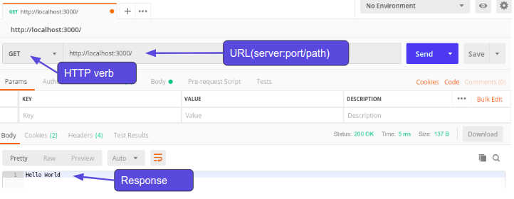

# Node and Express

- [Node and Express](#node-and-express)
  - [Requirements](#requirements)
  - [References](#references)
  - [Node.js Web Server](#nodejs-web-server)
  - [Using Postman](#using-postman)
  - [The request argument](#the-request-argument)
  - [Basic routing](#basic-routing)
    - [Listing students - the /students route (GET)](#listing-students---the-students-route-get)
    - [Invalid route handling](#invalid-route-handling)
  - [Restarting after errors with Forever](#restarting-after-errors-with-forever)
    - [Forever](#forever)
  - [NPM init, node_modules, and package.json](#npm-init-nodemodules-and-packagejson)
    - [Maintaining a node project in GitHub](#maintaining-a-node-project-in-github)
  - [Automatic restart with nodemon](#automatic-restart-with-nodemon)

## Requirements

* Postman - https://www.getpostman.com/

## References
[express js](https://expressjs.com/)
[body-parser](https://www.npmjs.com/package/body-parser)


## Node.js Web Server

We looked at this some weeks ago, but let's remember how we can create a simple http server in Nodejs. 

*Remind me - what is the purpose of a web server?*

The main purpose of any web server is to **store, process and deliver data** through the internet.

*What is the protocol that we use to send information across the web?*

Correct HTTP/S is the protocol we use.

*What are the HTTP verbs that we can use when communicating over HTTP and what are those verbs meant to be used for?*

* **POST** - creating a resource
* **GET** - reading a resource
* **PUT** - updating a resource
* **PATCH** - updating a resource
* **DELETE** - removing a resource

*When we were programming our Rails application what was the name of the web server that came pre-configured with Rails?*

Correct it was Puma. Node.js also comes with a web server but unlike Rails we need to actually setup our web server using the HTTP module that come with Node.js. Lets first create a new file called app.js and require the http module.

app.js

```javascript
const http = require("http");
```

Now that we have the module required we can use it to create our first web server in Node.

app.js

```javascript
const http = require('http');

const hostname = '127.0.0.1';
const port = 3000;

// When we create an http server, we pass it a callback function that performs the actions of the server
const server = http.createServer((req, res) => {
  res.statusCode = 200;
  res.setHeader('Content-Type', 'text/plain');
  res.end('Hello World');
});

// What is the third argument to the listen method on http server? When do you think it is called?
server.listen(port, hostname, () => {
  console.log(`Server running at http://${hostname}:${port}/`);
});
```

To run the server we need to use Node.js

```
node app.js
```

Lets go to localhost:3000 and see if everything is working. Awesome! We have a web server running.

Now looking at our callback function in createServer() we have two arguments (req and res). *Req* is short for *request* and holds information about the HTTP request we sent to the server and *res* is short for *response* and used to generate and send the HTTP response from the server.

Some things to notice about our server:
* No routes (no matter what we type in to the url we are always getting the ‘Hello Word’ message)
* No HTTP verb, just like above it doesn’t matter what verb we are using, it is all going to the same place. We can test this with Postman

## Using Postman
The simplest use of Postman is to send a request with no body to a URL. The URL will contain a server name, port, and optionally, a path:


You can change the request verb to Post, Put, Delete - any of the choices - and we will see the same response from the server.

## The request argument

Lets take a look inside of the req argument to see if it has any information we can use to create different routes and display different information based on those routes.

app.js

```javascript
const http = require('http');

const hostname = '127.0.0.1';
const port = 3000;

const server = http.createServer((req, res) => {
    console.log(req);
    res.end();
});

server.listen(port, hostname, () => {
  console.log(`Server running at http://${hostname}:${port}/`);
});
```

There is a bunch of information in the response object but the properties we are interested in to solve our issue is the method and url properties.

app.js

```javascript
const http = require('http');

const hostname = '127.0.0.1';
const port = 3000;

const server = http.createServer((req, res) => {
    console.log(req.method);
    console.log(req.url);
    res.end();
});

server.listen(port, hostname, () => {
  console.log(`Server running at http://${hostname}:${port}/`);
});
```

Looks like these hold the url for the request and the actual HTTP method used. 

## Basic routing
Let's use the url and method information from the request object to create a new app that takes a list of students and matches two together randomly for eating lunch together. We will have 3 different routes:

* ‘/‘ - Match 2 students together and return the match
* ‘/students’ - Get a list of all of our students
* ‘/students’ - Create a new student

*Which HTTP verb should we use for each route?*

* ‘/‘ - Match 2 students together and return the match (GET)
* ‘/students’ - Get a list of all of our students (GET)
* ‘/students’ - Create a new student (POST)

Ok now we know the route and the HTTP verb lets modify our code to look for these.

student-app.js

```javascript
const http = require('http');

const hostname = '127.0.0.1';
const port = 3000;

const server = http.createServer((req, res) => {
  if (req.method === "GET" && req.url === "/") {
    console.log("matching students");
  } // What other else/if should we add here to take care of all three routes, and any invalid route?

  res.end();
});

server.listen(port, hostname, () => {
  console.log(`Server running at http://${hostname}:${port}/`);
});
```

If we go to localhost:3000 and check the terminal we can see that we are logging to our terminal window “matching students”.

*What do we see at /students?*

*How can we test the /students POST route?*

So we can see that all of our routes are working lets actually use these routes now to finish off our apps functionality. 

### Listing students - the /students route (GET)
First lets start with showing all of our students. To mock this data we will just create an array to hold the names.

```javascript
const students = ["Nataha", "Shakti", "Santosh", "Allen", "James", "Blake"];
```

*What mime type we should set our Content-Type to?*

If we want to send back json then it should be application/json. If we want html then it should be text/html.

For a list of mime types visit this link:

https://developer.mozilla.org/en-US/docs/Web/HTTP/Basics_of_HTTP/MIME_types/Complete_list_of_MIME_types


We'll use json - let's add this code to the if block for GET on /students:

student-app.js

```javascript
console.log("getting students");
res.writeHead(200, {'Content-Type': 'application/json; charset=UTF-8'});
res.write(JSON.stringify(students));
```

After restarting the server and visiting localhost:3000/students we should see our student array as json. Lets now handle the functionality for when somewhen visits a route that doesn’t exist. 

### Invalid route handling

When we get an invalid route, let's throw an error saying that the route does not exist. 

But before we do that you may have noticed that whenever we are hitting the api through the browser two requests are coming through. One for the actual url we typed in and another to /favicon.ico, this is the browsers default behaviour so lets handle the /favicon.ico route as well.

We'll add another else/if block before the final else block that catches invalid routes, and the final else block:

student-app.js

```javascript
else if (req.url === "/favicon.ico") {
    console.log("We don’t have a favicon");
} else {
    console.log("could not find the route");
    throw "Route not found";
}
```

Ok so everything is still fine if we go to /students buts lets take a look at if we go to route that doesn’t exist such as /class. We see an error in the console but…….oh no it looks like our node program has exited and the web server is now completely shut down. If we try to go back to /students we can see that the web server is no longer running.

We need to use something that will restart our server if it errors and we don't catch it. This will be our first installed dependency for this app, so it's time to talk about our project environment.

## Restarting after errors with Forever

Inevitably our web server will run into an error. We as programmers try our best to code for every possible situation but in the end we are human and some things just slip through the gaps. It would be very bad if our whole web server stopped working just because we hit one error we did not catch. So we need something that makes sure our web server will be rebooted if it ever encounters an error and exits.

### Forever

Forever is a CLI tool that ensures a given script is run continuously (IE forever). So if we want to ensure our web server will reboot after a crash we can let forever handle it. Lets install forever and get it setup. But instead of installing it globally, let's talk about `npm init`, package `node_modules`, and `package.json`.


## NPM init, node_modules, and package.json
Think of JavaScript packages like gems in Ruby. If you have Node.js installed on your computer then you also have `npm`. This is a package manager originally created for Node.js but is now used throughout the JavaScript community in all projects.

We use `npm init` to create a new confguration file name `package.json` that saves all of our project information.

```
cd student-app
npm init

//Continue to hit the enter key until it is done. This creates our file with all the defaults.
```

Now we have our `package.json` file we can install a JavaScript package via `npm`.

```
npm install forever --save-dev
```

*Important - you should never sudo to install npm packages locally to a project.*

This command does two things, first it saves our third party packages into a directory called `node_modules`. Second it automatically modifies our `package.json` file to keep track of our project dependencies. In this case we have specified that `forever` is a development dependency only, and we don't want it to be part of our production environment. 

You might see a lot of documentation that says you need to include the `--save` or `-s` flag to `npm install` to save dependencies, but this is done by default as of `npm 5.0`.

One of the great things about `npm` is that we only need to keep track of our `package.json` file in our repo. We can install all of a projects dependencies simply by running **npm install**.

*Delete the node_modules directory and then run npm install. Notice how it recreated the directory and installed all of the dependencies from our package.json file (in this case it was only forever).*

---
### Maintaining a node project in GitHub
Since we can recreate `node_modules` just by running `npm i`, as long as our `package.json` is up to date, we don't have to commit or push it to our repo, and we shouldn't - it gets huge!

Remember to always include a `.gitignore` in your project directory that excludes `node_modules/`.

---

Now lets run `forever`.

```
./node_modules/.bin/forever -c "node" app.js
```

Now if we encounter an error `forever` will restart our web server.

## Automatic restart with nodemon

Another package we can take advantage of is `nodemon`. Nodemon is tool that watches for changes to any of our Node files and restarts the server when a change is made. This will save us from having to start and stop the server manually all the time. Lets install it.

```
npm i nodemon --save-dev
```
*npm i is shorthand for npm install*

Now normally we would run `nodemon` by calling the `nodemon` command and the name of our script but we want `forever` to run too. So instead we can get both of these running by doing this.

```
./node_modules/.bin/forever -c "nodemon —exitcrash -L" app.js
```

And there we go now we have the best of both worlds. But looking at this kinda gives me a headache so lets turn this into a much simpler command by adding it as an `npm script`.

We can as many scripts as we want to our `package.json` to create aliases for commands. We just give the script a name (the alias), and specify the command, like we do here for `node-server` to start our server app using `nodemon` and `forever`:

package.json

```javascript
{
    "name": "app",
    "version": "1.0.0",
    "description": "",
    "main": "app.js",
    "scripts": {
        "test": "echo \"Error: no test specified\" && exit 1",
        "node-server": "forever -c \"nodemon --exitcrash -L\" app.js"
    },
    "author": "",
    "license": "ISC",
    "devDependencies": {
        "nodemon": "^1.18.6”,
        "forever": "^0.15.3"
    }
}
```

Now all we have to do to get our web server running is to type this command.

```
npm run node-server
```

