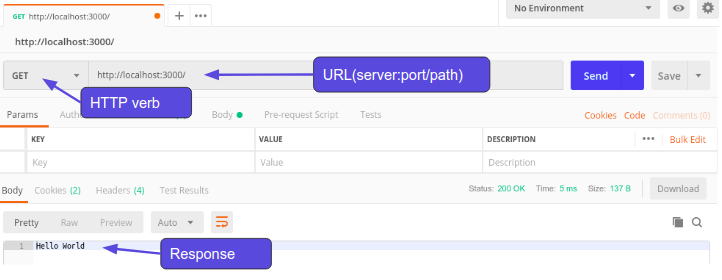

# Node and Express

## Requirements

* Postman - https://www.getpostman.com/


## Node.js Web Server

We looked at this some weeks ago, but let's remember how we can create a simple http server in Nodejs. 

*Remind me - what is the purpose of a web server?*

The main purpose of any web server is to **store, process and deliver data** through the internet.

*What is the protocol that we use to send information across the web?*

Correct HTTP/S is the protocol we use.

*What are the HTTP verbs that we can use when communicating over HTTP and what are those verbs meant to be used for?*

* **POST** - creating a resource
* **GET** - reading a resource
* **PUT** - updating a resource
* **PATCH** - updating a resource
* **DELETE** - removing a resource

*When we were programming our Rails application what was the name of the web server that came pre-configured with Rails?*

Correct it was Puma. Node.js also comes with a web server but unlike Rails we need to actually setup our web server using the HTTP module that come with Node.js. Lets first create a new file called app.js and require the http module.

app.js

```javascript
const http = require("http");
```

Now that we have the module required we can use it to create our first web server in Node.

app.js

```javascript
const http = require('http');

const hostname = '127.0.0.1';
const port = 3000;

// When we create an http server, we pass it a callback function that performs the actions of the server
const server = http.createServer((req, res) => {
  res.statusCode = 200;
  res.setHeader('Content-Type', 'text/plain');
  res.end('Hello World');
});

// What is the third argument to the listen method on http server? When do you think it is called?
server.listen(port, hostname, () => {
  console.log(`Server running at http://${hostname}:${port}/`);
});
```

To run the server we need to use Node.js

```
node app.js
```

Lets go to localhost:3000 and see if everything is working. Awesome! We have a web server running.

Now looking at our callback function in createServer() we have two arguments (req and res). *Req* is short for *request* and holds information about the HTTP request we sent to the server and *res* is short for *response* and used to generate and send the HTTP response from the server.

Some things to notice about our server:
* No routes (no matter what we type in to the url we are always getting the ‘Hello Word’ message)
* No HTTP verb, just like above it doesn’t matter what verb we are using, it is all going to the same place. We can test this with Postman

## Using Postman
The simplest use of Postman is to send a request with no body to a URL. The URL will contain a server name, port, and optionally, a path:


You can change the request verb to Post, Put, Delete - any of the choices - and we will see the same response from the server.

## The request argument

Lets take a look inside of the req argument to see if it has any information we can use to create different routes and display different information based on those routes.

app.js

```javascript
const http = require('http');

const hostname = '127.0.0.1';
const port = 3000;

const server = http.createServer((req, res) => {
    console.log(req);
    res.end();
});

server.listen(port, hostname, () => {
  console.log(`Server running at http://${hostname}:${port}/`);
});
```

There is a bunch of information in the response object but the properties we are interested in to solve our issue is the method and url properties.

app.js

```javascript
const http = require('http');

const hostname = '127.0.0.1';
const port = 3000;

const server = http.createServer((req, res) => {
    console.log(req.method);
    console.log(req.url);
    res.end();
});

server.listen(port, hostname, () => {
  console.log(`Server running at http://${hostname}:${port}/`);
});
```

Looks like these hold the url for the request and the actual HTTP method used. 

## Basic routing
Let's use the url and method information from the request object to create a new app that takes a list of students and matches two together randomly for eating lunch together. We will have 3 different routes:

* ‘/‘ - Match 2 students together and return the match
* ‘/students’ - Get a list of all of our students
* ‘/students’ - Create a new student

*Which HTTP verb should we use for each route?*

* ‘/‘ - Match 2 students together and return the match (GET)
* ‘/students’ - Get a list of all of our students (GET)
* ‘/students’ - Create a new student (POST)

Ok now we know the route and the HTTP verb lets modify our code to look for these.

student-app.js

```javascript
const http = require('http');

const hostname = '127.0.0.1';
const port = 3000;

const server = http.createServer((req, res) => {
  if (req.method === "GET" && req.url === "/") {
    console.log("matching students");
  } // What other else/if should we add here to take care of all three routes, and any invalid route?

  res.end();
});

server.listen(port, hostname, () => {
  console.log(`Server running at http://${hostname}:${port}/`);
});
```

If we go to localhost:3000 and check the terminal we can see that we are logging to our terminal window “matching students”.

*What do we see at /students?*

*How can we test the /students POST route?*

So we can see that all of our routes are working lets actually use these routes now to finish off our apps functionality. 

### Listing students - the /students route (GET)
First lets start with showing all of our students. To mock this data we will just create an array to hold the names.

```javascript
const students = ["Nataha", "Shakti", "Santosh", "Allen", "James", "Blake"];
```

*What mime type we should set our Content-Type to?*

If we want to send back json then it should be application/json. If we want html then it should be text/html.

For a list of mime types visit this link:

https://developer.mozilla.org/en-US/docs/Web/HTTP/Basics_of_HTTP/MIME_types/Complete_list_of_MIME_types


We'll use json - let's add this code to the if block for GET on /students:

student-app.js

```javascript
console.log("getting students");
res.writeHead(200, {'Content-Type': 'application/json; charset=UTF-8'});
res.write(JSON.stringify(students));
```

After restarting the server and visiting localhost:3000/students we should see our student array as json. Lets now handle the functionality for when somewhen visits a route that doesn’t exist. 

### Invalid route handling

When we get an invalid route, let's throw an error saying that the route does not exist. 

But before we do that you may have noticed that whenever we are hitting the api through the browser two requests are coming through. One for the actual url we typed in and another to /favicon.ico, this is the browsers default behaviour so lets handle the /favicon.ico route as well.

We'll add another else/if block before the final else block that catches invalid routes, and the final else block:

student-app.js

```javascript
else if (req.url === "/favicon.ico") {
    console.log("We don’t have a favicon");
} else {
    console.log("could not find the route");
    throw "Route not found";
}
```

Ok so everything is still fine if we go to /students buts lets take a look at if we go to route that doesn’t exist such as /class. We see an error in the console but…….oh no it looks like our node program has exited and the web server is now completely shut down. If we try to go back to /students we can see that the web server is no longer running.

We need to use something that will restart our server if it errors and we don't catch it. This will be our first installed dependency for this app, so it's time to talk about our project environment.

## Restarting after errors with Forever

Inevitably our web server will run into an error. We as programmers try our best to code for every possible situation but in the end we are human and some things just slip through the gaps. It would be very bad if our whole web server stopped working just because we hit one error we did not catch. So we need something that makes sure our web server will be rebooted if it ever encounters an error and exits.

### Forever

Forever is a CLI tool that ensures a given script is run continuously (IE forever). So if we want to ensure our web server will reboot after a crash we can let forever handle it. Lets install forever and get it setup. But instead of installing it globally, let's talk about `npm init`, package `node_modules`, and `package.json`.


## NPM init, node_modules, and package.json
Think of JavaScript packages like gems in Ruby. If you have Node.js installed on your computer then you also have `npm`. This is a package manager originally created for Node.js but is now used throughout the JavaScript community in all projects.

We use `npm init` to create a new confguration file name `package.json` that saves all of our project information.

```
cd student-app
npm init

//Continue to hit the enter key until it is done. This creates our file with all the defaults.
```

Now we have our `package.json` file we can install a JavaScript package via `npm`.

```
npm install forever --save-dev
```

*Important - you should never sudo to install npm packages locally to a project.*

This command does two things, first it saves our third party packages into a directory called node_modules and secondly it automatically modifies our package.json file to keep track of our project dependencies. In this case we have specified that `forever` is a development dependency only, and we don't want it to be part of our production environment. 

You might see a lot of documentation that says you need to include the `--save` or `-s` flag to `npm install` to save dependencies, but this is done by default as of `npm 5.0`.

One of the great things about `npm` is that we only need to keep track of our `package.json` file in our repo. We can install all of a projects dependencies simply by running **npm install**.

*Delete the node_modules directory and then run npm install. Notice how it recreated the directory and installed all of the dependencies from our package.json file (in this case it was only forever).*


Now lets run `forever`.

```
./node_modules/.bin/forever -c "node" app.js
```

Now if we encounter an error `forever` will restart our web server.

*Test this out using Postman.*

## Automatic restart with nodemon

Another package we can take advantage of is `nodemon`. Nodemon is tool that watches for changes to any of our Node files and restarts the server when a change is made. This will save us from having to start and stop the server manually all the time. Lets install it.

```
npm i nodemon --save-dev
```
*npm i is shorthand for npm install*

Now normally we would run `nodemon` by calling the `nodemon` command and the name of our script but we want `forever` to run too. So instead we can get both of these running by doing this.

```
./node_modules/.bin/forever -c "nodemon —exitcrash -L" app.js
```

And there we go now we have the best of both worlds. But looking at this kinda gives me a headache so lets turn this into a much simpler command by adding it as an `npm script`.

We can as many scripts as we want to our `package.json` to create aliases for commands. We just give the script a name (the alias), and specify the command, like we do here for `node-server` to start our server app using `nodemon` and `forever`:

package.json

```javascript
{
    "name": "app",
    "version": "1.0.0",
    "description": "",
    "main": "app.js",
    "scripts": {
        "test": "echo \"Error: no test specified\" && exit 1",
        "node-server": "forever -c \"nodemon --exitcrash -L\" app.js"
    },
    "author": "",
    "license": "ISC",
    "devDependencies": {
        "nodemon": "^1.18.6”,
        "forever": "^0.15.3"
    }
}
```

Now all we have to do to get our web server running is to type this command.

```
npm run node-server
```

## Express.js

Ok lets get back to finishing up the functionality of our web server. If we take a look at how it stands now its isn’t too bad but lets think about how this might all go wrong.

What issues do you think we are going to run into as we continue to develop our web server and API?

* Get very messy (unorganised) the more routes we add - it isn't very modular.
* Hard to do dynamic routes
* No where to properly put our validation
* No easy way to get the body of our request
* Cumbersome to put together a proper response (need to write our own headers)

So what if there was an easier way to manage our web server? Good news for us there is and its called Express.js!

Express describes itself as a Fast, unopinionated, minimalist web framework for Node.js. So lets take a look at how we can setup our web server using Express instead of the HTTP module that comes packaged with Node. First we need to install express.

```
npm i express
```

Lets create a new file to create our express server in called express.js

express.js

```javascript
const express = require("express");

const app = express();
const port = 3000;

app.get("/", (req, res) => {
    res.send("Hello World!");
});

app.listen(port, () => console.log(`Example app listening on port ${port}!`));
```

To get all the goodness from `forever` and `nodemon` will will also have to update our scripts in `package.json`. Lets create a new script and name it `express-server`.

package.json

```javascript
{
    "name": "app",
    "version": "1.0.0",
    "description": "",
    "main": "app.js",
    "scripts": {
        "test": "echo \"Error: no test specified\" && exit 1",
        "node-server": "forever -c \"nodemon --exitcrash -L\” app.js",
        "express-server": "forever -c \"nodemon --exitcrash -L\" express.js"
    },
    "author": "",
    "license": "ISC",
    "devDependencies": {
        "nodemon": "^1.18.6”,
        "forever": "^0.15.3"
    }
}
```

There we go we now have an express server running.

## Updating our routes using express
Now we can implement our student-app routes using express.

express.js

```javascript
const express = require("express");

const app = express();
const port = 3000;

const students = ["Natasha", "Shakti", "Santosh", "Allen", "James", "Blake"];

app.get("/", (req, res) => {
    res.send("Hello World!");
});

app.get("/students", (req, res) => {
    res.send(students);
});

app.post("/students", (req, res) => {
    res.send("Hello World!");
});

app.listen(port, () => console.log(`Example app listening on port ${port}!`));
```

Look at how clean express has made our code! Also we did not have to handle the 404 no route found because express automatically comes with a default error handling middleware.

## Middleware

To put it simply middleware is code that runs in the ‘middle’. Now this can get a little confusing because we can run our middleware really at any point. If we take a look at our code as it stands right now all the code is synchronous meaning the application is going to read in order so if want to add in some middleware before or after the routes we can literally place that code before or after all of the route calls using **app.use()**.

A commonly used middleware and one we are going to need to complete our POST route is **body-parser**. Lets log out the req in our POST route and in that request lets send through the name of a new student we would like to add using Postman.

express.js

```javascript
app.post("/students", (req, res) => {
    console.log(req);
    res.send("Hello World!");
});
```

If we search through the output in the terminal window there is no property holding the name we just through with the request. That is because at the moment the body information of the request is in the form of a stream. Now if we really wanted to we could convert this stream to actual usable data ourselves but with express’ concept of middleware we don’t have to!

Lets install the body-parser middleware.

```
npm install body-parser --save
```

Now lets import this module into our code use it.

express.js

```javascript
const express = require("express");
const bodyParser = require('body-parser');

const app = express();
const port = 3000;

const students = ["Natasha", "Shakti", "Santosh", "Allen", "James", "Blake"];

// parse application/x-www-form-urlencoded
app.use(bodyParser.urlencoded({ extended: false }));

// parse application/json
app.use(bodyParser.json());

app.get("/", (req, res) => {
    res.send("Hello World!");
});

app.get("/students", (req, res) => {
    res.send(students);
});

app.post("/students", (req, res) => {
    console.log(req.body);
    res.send("Hello World!");
});

app.listen(port, () => console.log(`Example app listening on port ${port}!`));
```

Now we can parse data coming into our server as either json or form-urlencoded. This middleware parses the data and saves it to the request as a body property, which we can now view using req.body. Notice how this middleware had to be defined before the routes because we need it to run before we access the request object on any particular route. If we defined this middleware after the routes it would not have ran in time.

Lets use this data now to complete the functionality for our /student POST route.

*Have the students take the name from the req.body property and add it the end of the students array. The route should respond with a 201 status and the modified array.*

express.js

```javascript
app.post("/students", (req, res) => {
    students.push(req.body.name);
    res.status(201).send(students);
});
```

One more note about middleware before we move on is that we can define it for a specific route as well. Lets add some custom middleware to our /students POST route that will always log the req.body.

express.js

```javascript
app.post(
    "/students",
    (req, res, next) => {
        console.log(req.body);
        next();
    }, 
    (req, res) => {
        students.push(req.body.name);
        res.status(201).send(students);
    }
);
```

We now have our custom middleware defined only on the /students POST route. The big difference you may have noticed is that there is a next argument. This method must be called for the code to move onto the next piece of logic in the chain. If you do not call next() then your code will never move on from the middleware. If we ever need to throw an argument from middleware we simply give it as an argument to the next() method **(next(new Error("my error")).**

**JavaScript Templating Engines**

Express is unopinionated meaning it doesn’t care which packages you use within its ecosystem and it doesn’t care how you layout your file structure. You must hook everything up for it to work, nothing really comes working right out of the box like we had with Rails magic. Although this can be a good thing since we know exactly how our code is working it can also lead to some confusion about setting up new features inside of express since the developer is the one who needs to wire it all together.

One of those confusing things we need to wire together is how exactly we serve html files from our express server. If we just want to serve an html string we can do so using the same send method on res

express.js

```javascript
app.get("/", (req, res) => {
    res.send(`<h1>My Header</h1>`);
});
```

We can see that this sends successfully but if we wanted to do anything more complex we wouldn’t be to. In comes in the power of a templating engine. In this lesson we are going to be using Handlebars as our JavaScript templating engine but there are many different ones out there that express supports.

https://github.com/expressjs/express/wiki#template-engines

Lets install the express-handlebars view engine

https://github.com/ericf/express-handlebars

```
npm install express-handlebars --save
```

According to the express-handlebars documentation we need to create a new directory called view and place some files within it like so.

```
└── views
    ├── home.handlebars
    └── layouts
        └── main.handlebars
```

Within those files lets put some content.

views/layouts/main.handlebars

```html
<!DOCTYPE html>
<html>
<head>
    <meta charset="utf-8">
    <title>Example App</title>
</head>
<body>

    {{{body}}}

</body>
</html>
```

views/home.handlebars

```html
<h1>It’s working!</h1>
```

Last but not least we need to include this package in express.js and instead of using **res.send()** to send our response back we will use res.render()

express.js

```javascript
const express = require("express");
const bodyParser = require('body-parser');
const exphbs = require('express-handlebars');

const app = express();
const port = 3000;

const students = ["Natasha", "Shakti", "Santosh", "Allen", "James", "Blake"];

app.engine('handlebars', exphbs({defaultLayout: 'main'}));

app.set('view engine', 'handlebars');

// parse application/x-www-form-urlencoded
app.use(bodyParser.urlencoded({ extended: false }));

// parse application/json
app.use(bodyParser.json());

app.get("/", (req, res) => {
    res.render('home');
});

app.get("/students", (req, res) => {
    res.send(students);
});

app.post("/students",(req, res, next) => {
    console.log(req.body);
    next();
}, (req, res) => {
    students.push(req.body.name);
    res.status(201).send(students);
});

app.listen(port, () => console.log(`Example app listening on port ${port}!`));
```

There we go, now its all working! Lets use handlebars to generate a webpage that will show us a random paring for students to eat lunch together.

views/home.handlebars

```html
<h1>Lunch Pair</h1>
<p>{{ student1 }} & {{ student2 }}</p>
```

express.js

```javascript
app.get("/", (req, res) => {
    let randomIndex1 = Math.floor(Math.random() * students.length);
    let randomIndex2 = Math.floor(Math.random() * students.length);
    res.render('home', { student1: students[randomIndex1], student2: students[randomIndex2]});
});
```
Alright! We have our webpage working now but something still just doesn’t feel right to me the way we have done this.

*Ask the class what we could improve (think about MVC).*

* seperate our routes out into a different file
* seperate our logic from our routes into a controller

*We will answer these questions in the next lesson.*


So what exactly is Node.js?

*Who here has heard of Node.js before?*

*Ok and who here can tell me exactly what Node.js is or for what purpose it was created?*

JavaScript has been used mainly for client-side scripting inside **< script >** tags executing in web browsers. This limitation meant that developers were often working in many different languages and frameworks between the front-end (client-side) and backend (server-side) aspects of a web application.  

Although there were other projects to bring JavaScript to server-side applications, the functionality took off with the launch of Node.js

Node allows developers to write JavaScript code that runs directly in a computer process itself instead of in a browser. Node can, therefore, be used to write server-side applications with access to the operating system, file system, and everything else required to build fully-functional applications.

In a nutshell Node.js allows JavaScript to be run on the machine and not just in a browser which opens up a world of possibilities.

*All of the below examples will work using Node.js version 8.10 - 10.13*

Lets create our first node script.

*Create a new directory and in that directory a file called app.js and place all of our JavaScript within it.*

app.js

```javascript
let a = 1;
let b = 2;

console.log(a + b);
```

Now lets run this script using node.

```
node app.js
```

We see the number 3! This may not seem too impressive because we were able to do this already with Ruby but as mentioned before JavaScript has not traditionally been able to run on a computer outside the browser. Also if you were paying attention when we were talking about JavaScript in the browser one of these lines of code may be a little confusing.

*Can anyone guess what I am talking about?*

It’s the console.log()! Technically we don’t have a console do we? Console.log() is a HTML DOM method, it is not a method that comes with the JavaScript language so how do we have it in our Node application? Well the smart people who developed Node understood that there was a lot of methods that JavaScript developers use all the time and to avoid confusion they made them available in Node with similar functionality. Another one of those methods is setTimeout().

app.js

```javascript
setTimeout(() => { console.log("async")}, 1000);
```

We know setTimeout is part of the Web API and when it executes it is handed to that Web API to avoid blocking the JavaScript call stack but we were able to use it in Node as well. What gives? Well Node also has the ability to run asynchronous code but instead of it handing it asynchronous calls to the Web API instead it hands them off to something else that functions in a very similar way (C++).

However you will find that there are methods we can use in the browser that are not available inside of Node.

app.js

```javascript
let name = prompt("What is your name?");

console.log(name);
```
If we were to run this code in the browser we would get a nice little pop up box asking us for our name but when we run this code in Node we get an error saying that prompt() is not defined. Now there are some npm packages we could include in our project to mimic this functionality but just to reiterate Node does not have it out of the box.

For a list of all the different modules that come with Node lets take a look at the docs.

https://nodejs.org/dist/v10.13.0/docs/api/

One module that catches my eye is the file system. Let’s take a look at how we could use this.

Now even though Node comes with a bunch of different modules not all of them make their code available through global variables. We will need to import this one. Node uses the CommonJS syntax for import and exporting modules.

```javascript
const fs = require("fs");
```
 
Now we have access to the file system modules through our fs variable. Lets create a new file.

```javascript
const fs = require("fs");

fs.appendFile('node.txt', 'Hello content!', function (err) {
    if (err) throw err;
    console.log('Saved!');
});
```

The appendFile method looks for a file to open and if it does not exist, it will create a new file and add the give string to the end. We can read this file using:

```javascript
const fs = require("fs");

const contents = fs.readFileSync("node.txt", "utf8");

console.log(contents);
```

**CommonJS**

Node.js has a different way it handles modularising our code then what we have learned about in the past. It currently does not support ES6 import and export statements (though this may be coming to node soon, at the moment it is in Node under experimental features) but instead using the import / export syntax of CommonJS.

Lets create another file and name it lodash.js and put some utility functions within it.

lodash.js

```javascript
function random() {
    console.log("My random function");    

    return Math.random();
}

function times(num, callback) {
    console.log("my times function");

    for (let i = 0; i < num; i++) {
        callback(i);
    }
}
```

Just like in ES6 exports we need to declare what we would like to export but CommonJS syntax is a little different. We use **module.exports** instead of just export.

```javascript
function random() {
    console.log("My random function");
    
    return Math.random();
}

function times(num, callback) {
    console.log("my times function");

    for (let i = 0; i < num; i++) {
        callback(i);
    }
}

module.exports = {
    random,
    times
}
```

Now to import our code we use the **require** statement.

app.js

```javascript
const myLodash = require("lodash");

console.log(myLodash.random());

myLodash.times(2, i => {
    console.log(i);
});
```

When we run this code we get an error! That is because if we are trying to import a file that is not a node_module or a Node.js module we must give  it a relative path.

app.js

```javascript
const myLodash = require("./lodash");

console.log(myLodash.random());

myLodash.times(2, i => {
    console.log(i);
});
```

Now it works. Lets also install the 3rd party lodash library using npm.

```
npm init
//Hit enter until it is done setting up
npm install lodash --save
```

The lodash library should be installed so lets import it into our app.

app.js

```javascript
const myLodash = require('./lodash');
const npmLodash = require('lodash');

console.log(myLodash.random());

myLodash.times(2, i => {
    console.log(i);
});

console.log(npmLodash.random(200));

let build = npmLodash.times(2, i => {
    return i;
});

console.log(build);
```

We can see that myLodash is importing code from the file we created and npmLodash is using the lodash package we just installed using npm. One big difference between CommonJS modules and ES6 modules are that CommonJS modules are loaded synchronously. We can take advantage of this behaviour by using the require statement to split out we want to run before our current code executes but not necessarily import anything. To understand what I mean lets create another new file called setup.js

setup.js

```javascript
console.log("We can run code here we need for setup or to maybe set a global variable like below");

global.myFavNumber = 3;
```

app.js

```javascript
require("./setup");

console.log("code after setup");
console.log(global.myFavNumber);
```

When we run this code setup.js runs first logs to the console and sets a global variable. After that the rest of app.js runs which prints out to the console another string and the value of the global variable we set.

**Node.js As A CLI**

Lets build a CLI using JavaScript and Node! We are going to create a very simple CLI that receives the users name, their favourite colour and then prints their name to the screen in that colour. Sounds easy right!

Well…..actually its not so easy in Node.js. In Ruby we have a really easy method built right into the language.
What was that method called?

That right is was **gets()** but in Node we don’t have such an easy method. Actually Node uses **stdin** to process input typed into the command line but thats a little to low level for us at the moment.

*So how can we solve this problem?*

Exactly, I’m sure there is an npm package we can use! Let’s take a look at the inquirer library.

https://www.npmjs.com/package/inquirer

*Ask if they think that this npm package is a good one and why*

* Lots of downloads
* Updated recently
* Active community
* Good docs

Remember that we are downloading code to our project that was created by someone on the internet. These people could go away tomorrow and no longer maintain the code base so it is always better to investigate a package before making our application depend on it.

Amazing this looks exactly like what we need. Lets install it and import it into app.js.

```
npm install inquirer —save
```

*Have the students import inquirer into app.js (answer below).*

app.js

```javascript
const inquirer = require("inquirer");
```

*Have the students read the inquirer document and ask the users name and fav colour. Then print those answers to the terminal window. (answer below, this may take some students a little while).*

app.js

```javascript
const inquirer = require("inquirer");

inquirer.prompt([
    {
        type: 'input',
        name: 'name',
        message: "What's your name?"
    },
    {
        type: 'input',
        name: 'color',
        message: "What's your favourite color?"
    },
])
    .then(answers => {
        console.log(answers);
    })
    .catch(error => console.log(error));
```

Awesome now we need to colour the text output with the users color. To do this lets install another JavaScript library called Chalk.

https://www.npmjs.com/package/chalk

Looks good. Lets install it.

```
npm install chalk —save
```

*Have the students incorporate the Chalk package into their CLI. (answer below).*

app.js

```javascript
const inquirer = require("inquirer");
const chalk = require("chalk");

inquirer.prompt([
    {
        type: 'input',
        name: 'name',
        message: "What's your name?"
    },
    {
        type: 'input',
        name: 'color',
        message: "What's your favourite color?"
    },
])
    .then(answers => {
        let {name, color} = answers;
        color = color.toLowerCase();
        if (!chalk[color]) {
            throw "Sorry I don't know that color";
        }
        console.log(chalk[color](name));
    })
    .catch(error => console.log(error));
```

This is working well but the user doesn’t know which colours we can use and we can’t. We should probably just them a selection of what’s available that they can choose from.

*Have students look through the Chalk and Inquirer documentation to see if they can figure out a solution to our problem.*

*Below is only one possible solution limiting the user selection to colours that Chalk has direct methods for but there are many other solutions like making the user type in a hex instead of the name of a colour or continuing asking the user for a colour until we get one that we can use…….*

app.js

```javascript
const inquirer = require("inquirer");
const chalk = require("chalk");

inquirer.prompt([
    {
        type: 'input',
        name: 'name',
        message: "What's your name?"
    },
    {
        type: 'list',
        name: 'color',
        message: 'What is your favourite color?',
        choices: [
            "black",
            "red",
            "green",
            "yellow",
            "blue",
            "magenta",
            "cyan",
            "white",
            "gray"
        ]
    }
])
    .then(answers => {
        let {name, color} = answers;
        color = color.toLowerCase();
        if (!chalk[color]) {
            throw "Sorry I don't know that color";
        }
        console.log(chalk[color](name));
    })
    .catch(error => console.log(error));
```

