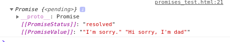
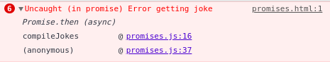

# Promises

- [Promises](#promises)
	- [Creating a Promise](#creating-a-promise)
	- [Resolving a Promise](#resolving-a-promise)
	- [Implementing our 5 joke array with Promises](#implementing-our-5-joke-array-with-promises)
	- [Adding DOM manipulation to the callback](#adding-dom-manipulation-to-the-callback)
		- [Defining the callback function](#defining-the-callback-function)
	- [Error handling and Promises](#error-handling-and-promises)
		- [Add error handling](#add-error-handling)
	- [Challenge](#challenge)
		- [Part 1 Using a promise](#part-1-using-a-promise)
		- [Part 2 Return multiple users](#part-2-return-multiple-users)
		- [Part 3 Add DOM manipulation to display results on the page](#part-3-add-dom-manipulation-to-display-results-on-the-page)

Promises are a lot like what they sound like. They are a placeholder for a return value from an asychnonous function. They promise to resolve with either a result or an error.

Promises are created like other objects with the _new_ keyword. Their constructor takes a callback function as an argument. That callback function executes some asynchronous code, and handles two outcomes: resolve and reject - which are also callback functions that just return whatever we pass them.

If the asynchronous function executes as expected, it calls the resolve callback with the result. If the asynchronous code encounters some error or fails, the reject callback is called with the error.

Let's look at the lifecycle of a Promise:


## Creating a Promise

Here is how we could implement a call to our dad joke API by creating and returning a Promise:

```javascript
function asyncGetJoke() {
	return new Promise(function getDadJoke(resolve, reject) {
		$.getJSON("https://icanhazdadjoke.com/", dadJoke => {
			if (dadJoke) resolve(dadJoke.joke)
			else reject("Error getting joke")
		})
	})
}
```

It's a good practice to name an asynchronous function appropriately. This function does not return a value to be used in synchronous program flow. _It returns a Promise_.

If we trying calling our function and log the result, we will see a pending Promise. Let's try.

```html
<!DOCTYPE html>
<html>
	<head>
		<script
			src="https://code.jquery.com/jquery-3.4.1.min.js"
			integrity="sha256-CSXorXvZcTkaix6Yvo6HppcZGetbYMGWSFlBw8HfCJo="
			crossorigin="anonymous"
		></script>
	</head>

	<body>
		<button id="button">Get Jokes</button>
		<div id="jokes"></div>
		<script>
			function asyncGetJoke() {
				return new Promise(function(resolve, reject) {
					$.getJSON("https://icanhazdadjoke.com/", dadJoke => {
						if (dadJoke) resolve(dadJoke.joke)
						else reject("Error getting joke")
					})
				})
			}
			let promise = asyncGetJoke()
			console.log(promise)
		</script>
	</body>
</html>
```

Here's what we see in console:


We can see that inside of the Promise - it is resolved, and we can even see our joke! But we have to get that resolved value using _then_.

## Resolving a Promise

We use the `.then` method to get the resolution of a Promise. When the Promise _settles_ (either resolves or rejects), we can use `.then` to access the result of our asynchronous function.

The `.then` method also takes a callback function as an argument. This function is executed when the Promise settles, and has access to the value passed back with `resolve`. Let's add this code to `promises_test.html`:

```javascript
promise.then(function logPromise(joke) {
	console.log(joke)
})
```

Now we can see the joke returned by the API call gets logged!

## Implementing our 5 joke array with Promises

In the last lesson when we saw that a chain of asynchronous function calls can lead to callback hell, we were asked to call the joke API 5 times, store the jokes in an array, then log the array. How can we do that with Promises?

Let's create another function called compileJokes that isn't recursive, and instead uses a loop and our asyncGetJoke method that returns a Promise:

```javascript
// compile some number(num) of jokes in an array
function compileJokes(num, callback) {
	let jokes = []
	for (let i = 0; i <= num; i++) {
		asyncGetJoke().then(dadJoke => {
			jokes.push(dadJoke)
			if (i == 5) callback(jokes)
		})
	}
}
```

How is this different from our recursive function? Let's put it here so we can compare:

```javascript
function compileJokes(num, callback, arr = []) {
	let url = "https://icanhazdadjoke.com/"
	$.getJSON(url, dadJoke => {
		arr.push(dadJoke.joke)
		if (num === arr.length) {
			return callback(arr)
		}
		return compileJokes(num, callback, arr)
	})
}
```

In our Promise implementation, we iterate with a loop (instead of using recursion).

We call the async function, which returns a Promise, and use the `.then` method to handle the resolution. When it resolves, we push the joke to our array, and when we have done this five times, we call the callback function with the array of jokes.

The way we call this async function is exactly the same way that we called the recursive function. The callback function we pass to compileJokes just logs the array of jokes that is passed to it:

```javascript
document.querySelector("#button").addEventListener("click", () => {
	compileJokes(5, data => {
		console.log(data)
	})
})
```

## Adding DOM manipulation to the callback

In addition to logging the array of jokes, we could also display them on the web page.

Notice that in our implementation, we implement the callback function passed to `compileJokes` as an anonymous function, specified directly in the argument list (we do the same for the recursive version). If we are going to add more code to this callback function, to display the jokes on the webpage in addition to logging the array to console, we should name the function, and make our code more modular.

### Defining the callback function

Let's define the callback function:

```javascript
function logAndDisplayJokes(jokes) {
	let jokesDiv = document.createElement("div")
	let body = document.querySelector("body")
	body.appendChild(jokesDiv)
	for (let joke of jokes) {
		let jokePara = document.createElement("p")
		jokePara.innerText = joke
		jokesDiv.appendChild(jokePara)
	}
	console.log(jokes)
}
```

This function will take the array of jokes as a parameter. It will create a new div in the body to display the jokes, each one in a paragraph element. It will also log the array of jokes to the console.

Now when we call `compileJokes`, we can simplify the call:

```javascript
document.querySelector("#button").addEventListener("click", () => {
	compileJokes(5, logAndDisplayJokes)
})
```

Now we have three functions defined. Instead of keeping them inline in our html file, let's put them in their own script, and include a reference to the script at the bottom of the body. This is done in `code/promises.html` and `code/promises.js`.

## Error handling and Promises

If we wanted to add error handling to our recursive implementation (or the callback hell implementation) to handle errors that come back from the jokes api, we would use try/catch. When we use Promises, we use the `.catch` method instead.

The `.catch` method will trigger when the Promise settles with a rejection.

### Add error handling

Adding error handling to our example is quite simple:

```javascript
function compileJokes(num, callback) {
	let jokes = []
	for (let i = 0; i <= num; i++) {
		asyncGetJoke()
			.then(dadJoke => {
				jokes.push(dadJoke)
				if (i == 5) callback(jokes)
			})
			.catch(err => {
				console.log("Error getting jokes", err)
			})
	}
}
```

Now if the Promise results in a rejection, the error will be logged instead of the exception bubbling up to our user. Let's test it.

We'll modify the Promise creation to reject:

```javascript
function asyncGetJoke() {
	return new Promise(function(resolve, reject) {
		$.getJSON("https://icanhazdadjoke.com/", dadJoke => {
			if (!dadJoke) resolve(dadJoke.joke)
			else reject("Error getting joke")
		})
	})
}
```

_What happens if we don't have the `.catch` and the Promise rejects?_

Remove the `.catch` and leave in the forced reject, and you'll see there is an uncaught error:


This is why it is important to handle rejected Promises.

## Challenge

In the **challenge** folder, there is an `index.html` and a `script.js`.

Currently in the `script.js`, there is a call to a random user API that uses a callback function to console.log the result of the response, or an error message if there is a problem.

**Step 1:** Open the index.html in a browser, and look at what is logged to the console.

**Step 2:** Make the following change to the definition of the `randomsUrl`, which will cause the API to return 10 random users:

```const randomsUrl = 'https://randomuser.me/api/?results=10';

```

Refresh `index.html` and look at the results that are logged.

Now that you have an understanding of what is returned by this API, here is your challenge!

### Part 1 Using a promise

Modify the script.js to use a promise instead of just a callback. Look at what we did in class for the dad jokes example and see if you can do the same to:

1. Get **one random user** and return their details in a JSON object. Console log those details like this example:

```
Name: Mrs Sally Ride
Email: sally.ride@example.com
Age: 32
```

To do this, you should:

- implement an asynchronous function that returns a promise, and that calls the API (like asyncGetJoke in our lesson example)
- implement a callback function that will be passed to the `.then` method of the promise that is returned, which will console log the results as indicated
- call the asynchronous function and pass the callback function you defined to the `.then` method

Take 30 minutes to try to implement this part of the challenge, then we will look at it together.

### Part 2 Return multiple users

Alter your asynchronous function to call the random user api and request 10 results. It should return the array of results when the promise resolves.

Console log the details for each of the 10 random users in your modified callback function that is passed to the `.then` method.

Note that this is unlike our lesson example where we made multiple calls to the asyncGetJoke function to get multiple dad jokes. This will be a bit simpler.

### Part 3 Add DOM manipulation to display results on the page

**A.** Modify the callback function to display the results on the web page in addition to logging the results. When the page loads, it should display the details for 10 random users.

**B.** Add a button to the page that will refresh the page with 10 new random users when clicked.
