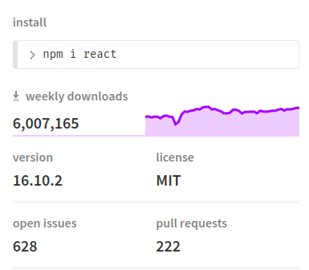
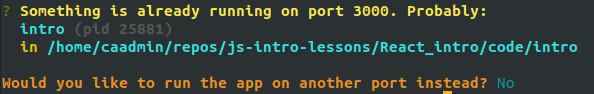
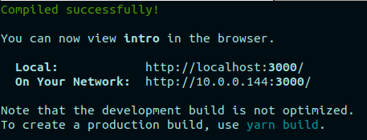

# React Intro

React is an open-source JavaScript library created by Facebook that is meant to show content to users (HTML) and handle any user interactions. In other words, it is a library used for front-end JavaScript development.

In this lesson, we will find out what React is and start to learn how to use it. We will use a popular _developer toolchain_ called **create-react-app** to generate our first React app, and learn some really cool benefits of using this package. We will learn about the structure of the app that is created with create-react-app, how we manage dependencies and how we start the application.

We will also find out what JSX is and how we use it, about using ReactDOM.render to add elements to the DOM so they show up in our app, and we'll take our first look at React components, which are the main architectural feature of React applications.

By the end of this lesson, you will be able to create and run a simple React app.

- [React Intro](#react-intro)
  - [References](#references)
  - [React](#react)
  - [React and ReactDOM](#react-and-reactdom)
  - [React developer toolchains](#react-developer-toolchains)
  - [Create React App](#create-react-app)
  - [React app structure](#react-app-structure)
  - [Starting the app](#starting-the-app)
  - [Some awesome benefits of create-react-app (why we use it)](#some-awesome-benefits-of-create-react-app-why-we-use-it)
    - [Dynamic rebuild after changes](#dynamic-rebuild-after-changes)
    - [Port prompt](#port-prompt)
    - [Hosted on local network automatically](#hosted-on-local-network-automatically)
  - [JSX Intro](#jsx-intro)
  - [Starting from scratch in src](#starting-from-scratch-in-src)
    - [ReactDOM.render()](#reactdomrender)
  - [Transpiled JSX](#transpiled-jsx)
  - [Functional (Simple) Components](#functional-simple-components)
  - [Component Nesting](#component-nesting)
  - [Interpolation in JSX](#interpolation-in-jsx)
  - [Challenge - Create a happy message app](#challenge---create-a-happy-message-app)

## References

- [react package](https://www.npmjs.com/package/react)
- [reactjs.org](https://reactjs.org)
- [JSX](https://reactjs.org/docs/introducing-jsx.html)

## React

React is javascript that is used to populate the DOM with content, and to update that content with user interaction. Part of its power comes from its component-based architecture and syntax, which allows us to build complex and powerful front-end applications with relatively simple code (it isn't simple, but compared to the code we would have to write in vanilla javascript to do the same thing - it is relatively simple).

The other thing that makes React powerful is its algorithms for determining when a changed component needs to be rendered again - or in other words, which parts of a web page need to be refreshed. The result is that any part of a web page is only refreshed when changes require it, making the performance of React apps better than what we could reasonably build with vanilla javascript.

## React and ReactDOM

While React is a large and powerful library, there is really only 2 packages we need to use to get an application running, and that is **React** and **ReactDOM**.

The React package contains all the functionality required to define and use **React components**. It is used in combination with a React rendering package, such as `react-dom` for web development, or `react-native` for mobile app development.

The popularity of the React package is evidenced by its weekly downloads (!), its issue count, and number of open pull requests:



To reiterate, React is:

- a JavaScript library to build user interfaces(UI)
- used to build re-usable components (HTML elements), which display data as it changes over time
- an open-source project created by Facebook
- the **view** layer of an MVC application (Model View Controller)

## React developer toolchains

React developer toolchains are provided to make developing React applications easier and less error-prone.

The React team primarily recommends these solutions:

- If you’re learning React or creating a new single-page app, use [Create React App](https://reactjs.org/docs/create-a-new-react-app.html#create-react-app).
- If you’re building a server-rendered website with Node.js, try [Next.js](https://reactjs.org/docs/create-a-new-react-app.html#nextjs).
- If you’re building a static content-oriented website, try [Gatsby](https://reactjs.org/docs/create-a-new-react-app.html#gatsby).
- If you’re building a component library or integrating with an existing codebase, try [More Flexible Toolchains](https://reactjs.org/docs/create-a-new-react-app.html#more-flexible-toolchains).

Since we are learning, and creating new single-page apps, we will use **Create React App**

## Create React App

As mentioned above to get React working at a minimum we only need 2 different JavaScript packages and we would have everything we need to build complicated applications. However, React is also capable of working with thousands of packages to make our lives easier as developers. Instead of writing out a bunch of code from scratch we will frequently pull in other 3rd party packages or JavaScript libraries that make our development a little bit faster and a little bit easier, just like we did with our server-side application in ExpressJs, or our Rails application.

One tool that is available to us to generate our React application is called **Create React App**. This tool saves us time by doing the setup and configuration every time we generate a new React application.

Lets install Create React App globally on our machines using `npm`. Note that global installs probably require `sudo` on your system, so if it fails for you the first, time, try with `sudo`.

```
npm i -g create-react-app
```

We can verify the installation was successful by running

```
create-react-app --version
```

The version should match the latest stable version reported on the [create-react-app npm page](https://www.npmjs.com/package/create-react-app).

Now that we have create-react-app installed lets generate our first React application using this tool. Go to your projects directory (or a javascript projects directory) and run this:

```
create-react-app intro
```

Let's take a look and see exactly what `create-react-app` has done for us.

Lets start by looking at the package.json file and see the dependencies we have.

package.json

```javascript
{
  "name": "intro",
  "version": "0.1.0",
  "private": true,
  "dependencies": {
    "react": "^16.10.2",
    "react-dom": "^16.10.2",
    "react-scripts": "3.2.0"
  },
  "scripts": {
    "start": "react-scripts start",
    "build": "react-scripts build",
    "test": "react-scripts test",
    "eject": "react-scripts eject"
  },
  "eslintConfig": {
    "extends": "react-app"
  },
  "browserslist": {
    "production": [
      ">0.2%",
      "not dead",
      "not op_mini all"
    ],
    "development": [
      "last 1 chrome version",
      "last 1 firefox version",
      "last 1 safari version"
    ]
  }
}
```

Create-react-app does an amazing job of abstracting away all of the development build process into another npm package called **react-scripts**. If we take a look inside of `node_modules/react-scripts/scripts` and choose the `start.js` file we see that inside of here we have a full build process using webpack, babel and webpack-dev-server (along with some others). Those 3 depend on many different packages to function correctly, and `npm ls` would show that all of those packages are installed in our project.

We don't have to be familiar with everything here - we can let create-react-app worry about that for us. When we need to understand something, we can look closer at it.

## React app structure

Let's take a look at the other files create-react-app has generated for us.

- **src** - The src directory is where we are going to be placing all of our JavaScript code. This is directory that will house our entire React application. At the moment we have some files pre-generated for us that set up a basic React application, which we will delete shortly.
- **public** - The public directory holds static files (files that do no change). We can see that a couple of files have already been pre-generated for us such as the favicon and an index.html file.
- **node_modules** - Holds all of our 3rd party dependencies
- **package.json** - Records our projects dependencies and configures our project
- **package.lock.json** - Records the exact versions of the packages we have installed
- **README.md** - Instructions on how to use our project. This should be updated as we implement the application.

## Starting the app

Now that we have some understanding of the structure of our React application lets go ahead and start it.

```
yarn start
```

This command bundles all of our code together and launches our React application.

---

**npm vs. yarn**

React is Facebook's project, and so is **yarn**, so it's no surprise that by default, `create-react-app` uses yarn to manage project dependencies.

You can still use **npm** if you prefer - just remove the `yarn.lock` file to avoid issues. Many will argue that yarn is a better package manager because it is faster with dependency installation. Others argue that the latest npm is just as fast and more secure. Really either is fine - just make sure that if you are working on a project with others, that everyone uses the same thing.

---

## Some awesome benefits of create-react-app (why we use it)

Not only does create-react-app include a lot of bootstrapping for us that makes writing a new React app much simpler, it also has some cool features that make us developers happy. Here are a few.

### Dynamic rebuild after changes

As we make changes to our application it will automatically build those changes and refresh our browser page. Lets test this out by changing the line in `App.js` that has

```
Edit <code>src/App.js</code> and save to reload.
```

to be

```
Auto compile and reload!
```

If we go back to the browser, we see our new text automatically. How awesome is that!

### Port prompt

By default, `create-react-app` will specify that the app runs on port 3000, but if something is already running on 3000, you will be prompted to allow using a different port. Let's get this message to occur by starting another instance of the app.

Open up a new terminal (or terminal tab) and run `yarn start`. You should see a message like this:



Just type in **Y** and hit enter. Create-react-app will find another (available) port to use.

### Hosted on local network automatically

Another really cool thing that `create-react-app` does automatically for us is make our application available on the local network. When you start your React application you will see a message like this (with a different ip address):



Instead of going to localhost:3000, you can also go to the second address listed. Try it out in your browser. We get the same screen, so whats the big deal? Make sure your mobile device is also connected to the same network as your computer and use it to go to that same address.


Wow! Yep we can view our application from different devices on the same network. So when you're building your app, you can have anyone on the same network have a look - or you can see what it looks like on different devices. This is a special kind of awesome sauce!

Ok now that we understand some benefits of `create-react-app` there are a couple of other concepts to cover before we jump into build an application.

## JSX Intro

Just like we used ERB with Rails to combine html and ruby, we will use JSX with React. Like Rails, React embraces the fact that rendering the user interface is tightly coupled with the logic used to determine what to render - the event handler logic and data(state) change logic.

JSX (JavaScript + XML) is just syntactical sugar for normal JavaScript code. Our `create-react-app` generated project includes [babel](https://babeljs.io/), which will **transpile** the jsx into javascript that the browser will understand. It allows us to write code like this:

```javascript
ReactDOM.render(<h1>Hi there, my good friend!</h1>, document.getElementById("root"))
```

This allows us to add html elements to the DOM with a simplified html-like syntax.

Let's try this out in our application.

## Starting from scratch in src

We're going to start by deleting all the files in the `src` directory. Don't be afraid.

Now create an **index.js**. Create-react-app looks for a file called `index.js` when it tries to build our code. If we don’t have an `index.js` then we don’t get any code compiling, which means we don’t get a React app.

The first thing we need to in this file is import the 2 packages that make up any React application.

- react
- react-dom

index.js

```javascript
import React from "react"
import ReactDOM from "react-dom"
```

_What type of import statements are these?_

They are ES6 (ES2015) import statements. Unlike NodeJS which uses CommonJS import statements that would look like this:

```javascript
const React = require("react")
```

React uses the ES6 syntax for importing modules.

Ok, now that we have our modules imported lets get something displaying on the screen. To implement a React application all you need to do is call **[ReactDOM.render()](https://reactjs.org/docs/react-dom.html#render)**.

### ReactDOM.render()

This method is used to render _components_ in DOM _container nodes_. They are referred to as **container** nodes because they are the containers for React (JSX) components.

The main application will generally render to the **root** node.

The first argument the **render** method takes is a **JSX component**. And the second argument is the **DOM node** (container node) to which we are going to render the component. It optionally takes a callback function as a third argument that will be called when the render completes. If the component has already been rendered, it will be updated if any changes have been made to it, using React's diffing algorithm for effective updates.

To display our welcome message when the app is run, we can define that message as a JSX component, and render it to the `root` DOM container node:

index.js

```javascript
import React from "react"
import ReactDOM from "react-dom"

ReactDOM.render(<h1>Hi there, my good friend!</h1>, document.getElementById("root"))
```

And now we are rendering our content to the screen. If you’ve been paying attention these couple of lines we just wrote may seem a bit confusing. I said the first element we need to pass to the render method is a JSX component but that looks a lot like HTML. This `<h1>` tag may look like HTML but it is actually a JSX component whose purpose is to render an `<h1>` to the `root` DOM node.

---

**VSCode is messing up my formatting when it saves!**

If you are finding that VSCode is destroying your formatting when you save, this is because of some javascript extension you have installed. The easiest way to deal with this that I've found is to associate .js files with JavaScript React. If you're not having this problem, you don't have to do this. You can change the file association by:

1. Click on the language mode at the bottom of the VSCode window (if you have index.js selected, it should say 'JavaScript')
2. At the top of the window, select 'Configure file association for .js'
3. Search for 'React'
4. Select 'JavaScript React'

[There is a short video on YouTube demonstrating this here.](https://youtu.be/n8Ghy6MQ1Cc)

---

## Transpiled JSX

Let's see what babel does with a JSX component.

_Go to - https://babeljs.io/repl_
_Make sure react and es2016 are selected under presets in the lefthand bar._
_Paste in the JSX component code from the call to render in index.js (`<h1>Hi there, my good friend!</h1>`)_

So, as we can see in the example babel has take our JSX and converted it to a JavaScript method call React.createElement(). We can verify this by taking the transpiled JSX and use it in our application. Replace what we currently have in index.js with what babel provides:

index.js

```javascript
ReactDOM.render(
	React.createElement("h1", null, "Hi there, my good friend!"),
	document.getElementById("root")
)
```

Once you save the file you will notice no difference to the rendered HTML in our application. Try changing “h1” to be another valid HTML tag such as a “p”. Wow its now rendering a `<p>` tag! Ok so this is pretty cool but whats the big deal? Why wouldn’t we just use the the React.createElement() method to make our html elements, instead of bringing in another layer of complexity such as JSX? Well JSX really starts to shine when we start to write some more complex HTML. Take for example the below HTML.

```html
<ul>
	<li>one</li>
	<li>two</li>
	<li><a href="#">three</a></li>
</ul>
```

Pretty common HTML right? We have an unordered list of three items with one of those items being a link. Now how could we write this using `React.createElement()`?

We can use `babeljs.io.repl` to transpile any html into the javascript we would have to write to render it in React. Paste this code into the babel editor and see what we would need to do:

```javascript
React.createElement(
	"ul",
	null,
	React.createElement("li", null, "one"),
	React.createElement("li", null, "two"),
	React.createElement(
		"li",
		null,
		React.createElement(
			"a",
			{
				href: "#"
			},
			"three"
		)
	)
)
```

Wow that is verbose! And that was just for some simple HTML. Think about how much HTML is on any normal webpage! This is the beauty of JSX. We can write HTML like syntax that gets transpiled in JavaScript for us, so we can avoid all the complexity. We can even create our own custom JSX tags!

Before we move any further, we need to talk about **components**!

## Functional (Simple) Components

Components are the basic building blocks of a React application. A React component is:

- A function or a class
- that produces HTML
- and handles any feedback from the user (event handlers)

Functional components (components created using a function) are simpler than class components, so we'll start with those.

We will create a functional component that renders a greeting in our browser. The first step in building a functional component is to assign it to a function.

index.js

```javascript
//Above ReactDOM.render()
const Greeting = () => {}
```

Note that the function name begins with a capital letter. The convention for React components is to use PascalCase.

The main purpose of a component is to render HTML to the DOM, so this component will need to **return some JSX**. We'll have it return the JSX we had in the call to render:

index.js

```javascript
//Above ReactDOM.render()
const Greeting = () => {
	return <h1>Hi there, my good friend!</h1>
}
```

And thats it! Now we have built our first functional component! Now let's use it. Replace the React.createElement() with our new functional component like this:

index.js

```javascript
ReactDOM.render(<Greeting />, document.getElementById("root"))
```

Whenever we create a component we can wrap it within <>, essentially turning it into JSX. And since babel knows how to deal with JSX it can convert it into JavaScript our browser can read. It's important to always close component tags, even if they don't have children.

## Component Nesting

What if we want to render multiple JSX components? It wouldn't be a good practice to have all of our logic in a single component that is rendered to the root node, so we'll have to be able to render multiple components in our root render. Let's see what happens if we try to render our greeting a couple of times in ReactDOM.render().

index.js

```javascript
ReactDOM.render(
    <Greeting /><Greeting />,
    document.getElementById("root")
);
```

Hmmm….we get an error, "Adjacent JSX elements must be wrapped in an enclosing tag”. So what does this mean? Basically it means that JSX needs a single top level component. _You cannot render multiple JSX components that are siblings without them being nested within a single parent._ To fix our error lets wrap our custom JSX components within a `<div>` component.

index.js

```javascript
ReactDOM.render(
	<div>
		<Greeting />
		<Greeting />
	</div>,
	document.getElementById("root")
)
```

And now it works! We have just done what is called component nesting. We have nested our 2 `<Greeting />` components within a single `<div>` component.

_Ok this is great and all but what problems to you see occurring if we keep sticking with this approach?_

It’s going to get very messy very quickly. Think about how many components our application may have!

The great thing about React and JSX is that we can abstract away JSX components into other JSX components. Lets take the example above and split it up into more manageable code. We can create our own custom JSX component named <App /> which will hold all of the other components for our application.

index.js

```javascript
import React from "react"
import ReactDOM from "react-dom"

const Greeting = () => {
	return <h1>Hi there, my good friend!</h1>
}

const App = () => {
	return (
		<div>
			<Greeting />
			<Greeting />
		</div>
	)
}

ReactDOM.render(<App />, document.getElementById("root"))
```

Now this is looking much better. We only pass a single <App /> component to ReactDOM.render() and within that <App /> component we use component nesting to render the rest of our application. Notice however we weren’t able to get rid of that enclosing `<div>` component. Even our custom components must still only render 1 top level JSX component.

Note that if you want to format the JSX that is returned on multiple lines like it is shown here, you need to include the parentheses () around the JSX that is returned.

## Interpolation in JSX

As you can probably imagine, it will be important to be able to refer to variables and functions in our JSX. We can do this simply using curly braces. Here's an example:

```javascript
const Greeting = () => {
	let name = "Mr. Sunshine"
	return <h1>Hi there, my good friend, {name}!</h1>
}
```

In this way, we can put variables, function calls, or any javascript that can be interpreted into our JSX!

## Challenge - Create a happy message app

The best way to learn something is to repeat the process! In the challenge, you will follow the steps to create another react app.

1. Use create-react-app to create an app called `happy-message`
2. Remove the files in the `src` directory
3. Create an `index.js` file and import the two required packages for a React application
4. Write a functional component called `HappyMessage` that returns a random inspirational or kind message as a JSX paragraph. The message should come from an array of 5 messages. (_Hint: It will be useful to define a helper function to return the message to include in the JSX_).
5. Write another function component called `App` that returns `<HappyMessage \>`
6. Use ReactDom.render to display your random happy message in the browser
7. Test it! Run your app (`yarn start` from the app directory) and make sure you get your random happy message, and that you get a new message when you refresh the page

If you get stuck, look back at the lesson and take one step at a time:

- first just try rendering a hard-coded message
- then add the functional component and have it return the hard-coded message
- next add the App component and have it return your functional component
- finally add the code to generate a random message

If you get really stuck, ask one of your colleagues for help.

If you get really, really stuck - there is an example solution in the challenge folder. But don't look there until you give a good try on your own!
